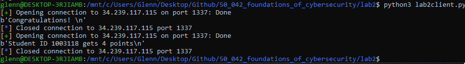

# 1. Installations

For this lab, we need the `pwn` library which allows us to connect to the server to send and receive messages 

## 1.1 The Windows way (No Ubuntu) - does not work

<u>**1. Install `pwntools`**</u> 

https://pypi.org/project/pwntools/

- This is the way to get `pwn` to work on Windows 

Note: We have to upgrade pip first (Use the terminal as an Admin)


Actual installation (Don't do this because the package is outdated)


**This installs the package (Later we find that this is not the legit one). We then get an error "No module named '_curses'"**

METHOD 1 (Recommmended)

Link: https://github.com/pmbarrett314/curses-menu/issues/18

Run `pip install windows-curses`

METHOD 2 (Not recommended)

Link: https://www.lfd.uci.edu/~gohlke/pythonlibs/#curses

- Download the version of curses that corresponds to your Windows and version of Python, and then pip install the whl file with the python you plan on using.
- In my case, I am using Windows 10 and Python 3.7. Hence, I choose `curses‑2.2.1+utf8‑cp37‑cp37m‑win_amd64.whl`

<u>**2. After that when we run the code again we have another error**</u>

Error: `SyntaxError: invalid syntax: "def goto((r, c)):"`

Solution: Reinstall pwntools

Link: https://github.com/arthaud/python3-pwntools/issues/3

```
pip3 install git+https://github.com/arthaud/python3-pwntools.git
```

**3. Finally after this stage I get an error `ModuleNotFoundError: No module named 'fcntl'`**

Link:https://stackoverflow.com/questions/1422368/fcntl-substitute-on-windows

https://github.com/cs01/gdbgui/issues/18

https://stackoverflow.com/questions/1422368/fcntl-substitute-on-windows

Basically no fix at this stage as the solution stated has an invalid link

## 1.2  The windows way with Ubuntu app

<u>**Step 1**</u>

Initially when I was installed the Ubuntu app, I was stuck at the phrase `Installing, this may take a few minutes...`

https://askubuntu.com/questions/966184/new-installation-of-windows-10-and-ubuntu-from-windows-store-error

1. From the search, find `PowerShell`

2. Enter this command in `PowerShell` 

   ```shell
   Enable-WindowsOptionalFeature -Online -FeatureName Microsoft-Windows-Subsystem-Linux
   ```


<u>**Step 2**</u>

I start with a fresh install of the Ubuntu app from the Microsoft Store. 


Step 3: Enter a username and password


Step 4: Run the following commands

1. `sudo apt-get update`
   
2. Install pip with `sudo apt install python-pip`
   
   If successful we will get the screenshot below. Verify with `pip -V`
   
3. Install pip3 with `sudo apt install python3-pip`
   
   If successful
   
4. Once done, we can cd into the folder with the bash installation file and run it with `sudo ./install.sh`
   
   If successful, we should see 
   

# 2. Running the functions

## 2.1 Running the first function - sol1()

Function

```python
def sol1():
    conn = remote(URL, PORT)
    message = conn.recvuntil('-Pad')  # receive TCP stream until end of menu
    conn.sendline("1")  # select challenge 1

    dontcare = conn.recvuntil(':')
    challenge = conn.recvline()
    print(challenge)
    # decrypt the challenge here
    solution = int(0).to_bytes(7408, 'big')
    conn.send(solution)
    message = conn.recvline()
    message = conn.recvline()
    if b'Congratulations' in message:
        print(message)
    conn.close()

```

We run the function with `python3 lab2Client.py`


```
b"->..-O2\x0cO|uYIX\t\tcKYO2FXcK2I2.>_O2.tO\x0cO2;IE2I2|OI\x0c2->..-O2 >\x0c-2;tc2;IE2-csO|\t<'2OsO\x0c'2cKO2;tc2-ccVO|2I.2tO\x0cp2<F.2_cE.2ce2I--2<'2tO\x0c\t \x0cIK|_c.tO\x0cp2IK|2.tO\x0cO2;IE2Kc.t>K 2.tI.2EtO2;cF-|2Kc.2tIsO\t >sOK2.c2.tO2Yt>-|W22cKYO2EtO2 IsO2tO\x0c2I2->..-O2YIX2ce2\x0cO|\tsO-sO.p2;t>Yt2EF>.O|2tO\x0c2Ec2;O--2.tI.2EtO2;cF-|2KOsO\x0c2;OI\x0c\tIK'.t>K 2O-EOW22Ec2EtO2;IE2I-;I'E2YI--O|2->..-O2\x0cO|uYIXW\t\tcKO2|I'2tO\x0c2_c.tO\x0c2EI>|2.c2tO\x0cp2Yc_Op2->..-O2\x0cO|uYIXp2tO\x0cO\t>E2I2X>OYO2ce2YIVO2IK|2I2<c..-O2ce2;>KOW22.IVO2.tO_2.c2'cF\x0c\t \x0cIK|_c.tO\x0cp2EtO2>E2>--2IK|2;OIVp2IK|2.tO'2;>--2|c2tO\x0c2 cc|W\tEO.2cF.2<Oec\x0cO2>.2 O.E2tc.p2IK|2;tOK2'cF2I\x0cO2 c>K p2;I-V\tK>YO-'2IK|2{F>O.-'2IK|2|c2Kc.2\x0cFK2cee2.tO2XI.tp2c\x0c2'cF2_I'\teI--2IK|2<\x0cOIV2.tO2<c..-Op2IK|2.tOK2'cF\x0c2 \x0cIK|_c.tO\x0c2;>--\t O.2Kc.t>K W22IK|2;tOK2'cF2 c2>K.c2tO\x0c2\x0ccc_p2|cKv.2ec\x0c O.\t.c2EI'p2 cc|u_c\x0cK>K p2IK|2|cKv.2XOOX2>K.c2OsO\x0c'2Yc\x0cKO\x0c2<Oec\x0cO\t'cF2|c2>.W\t\t>2;>--2.IVO2 \x0cOI.2YI\x0cOp2EI>|2->..-O2\x0cO|uYIX2.c2tO\x0c2_c.tO\x0cp2IK|\t IsO2tO\x0c2tIK|2cK2>.W\t\t.tO2 \x0cIK|_c.tO\x0c2->sO|2cF.2>K2.tO2;cc|p2tI-e2I2-OI FO2e\x0cc_2.tO\ts>--I Op2IK|2RFE.2IE2->..-O2\x0cO|uYIX2OK.O\x0cO|2.tO2;cc|p2I2;c-e\t_O.2tO\x0cW22\x0cO|uYIX2|>|2Kc.2VKc;2;tI.2I2;>YVO|2Y\x0cOI.F\x0cO2tO2;IEp\tIK|2;IE2Kc.2I.2I--2Ie\x0cI>|2ce2t>_W\t\t3 cc|u|I'p2->..-O2\x0cO|uYIXp32EI>|2tOW\t\t3.tIKV2'cF2V>K|-'p2;c-eW3\t\t3;t>.tO\x0c2I;I'2Ec2OI\x0c-'p2->..-O2\x0cO|uYIXf3\t\t3.c2_'2 \x0cIK|_c.tO\x0cvEW3\t\t3;tI.2tIsO2'cF2 c.2>K2'cF\x0c2IX\x0ccKf3\t\t3YIVO2IK|2;>KOW22'OE.O\x0c|I'2;IE2<IV>K u|I'p2Ec2Xcc\x0c2E>YV\t \x0cIK|_c.tO\x0c2>E2.c2tIsO2Ec_O.t>K 2 cc|p2.c2_IVO2tO\x0c2E.\x0ccK O\x0cW3\t\t3;tO\x0cO2|cOE2'cF\x0c2 \x0cIK|_c.tO\x0c2->sOp2->..-O2\x0cO|uYIXf3\t\t3I2 cc|2{FI\x0c.O\x0c2ce2I2-OI FO2eI\x0c.tO\x0c2cK2>K2.tO2;cc|W22tO\x0c2tcFEO\tE.IK|E2FK|O\x0c2.tO2.t\x0cOO2-I\x0c O2cIVu.\x0cOOEp2.tO2KF.u.\x0cOOE2I\x0cO2RFE.\t<O-c;W22'cF2EF\x0cO-'2_FE.2VKc;2>.p32\x0cOX->O|2->..-O2\x0cO|uYIXW\t\t.tO2;c-e2.tcF t.2.c2t>_EO-ep2;tI.2I2.OK|O\x0c2'cFK 2Y\x0cOI.F\x0cOW22;tI.2I\tK>YO2X-F_X2_cF.teF-p2EtO2;>--2<O2<O..O\x0c2.c2OI.2.tIK2.tO2c-|\t;c_IKW22>2_FE.2IY.2Y\x0cIe.>-'p2Ec2IE2.c2YI.Yt2<c.tW22Ec2tO2;I-VO|\tec\x0c2I2Etc\x0c.2.>_O2<'2.tO2E>|O2ce2->..-O2\x0cO|uYIXp2IK|2.tOK2tO\tEI>|p23EOO2->..-O2\x0cO|uYIXp2tc;2X\x0cO..'2.tO2e-c;O\x0cE2I\x0cO2I<cF.2tO\x0cOW\t;t'2|c2'cF2Kc.2-ccV2\x0ccFK|W22>2<O->OsOp2.ccp2.tI.2'cF2|c2Kc.\ttOI\x0c2tc;2E;OO.-'2.tO2->..-O2<>\x0c|E2I\x0cO2E>K >K W22'cF2;I-V2 \x0cIsO-'\tI-cK 2IE2>e2'cF2;O\x0cO2 c>K 2.c2EYtcc-p2;t>-O2OsO\x0c'.t>K 2O-EO2cF.\ttO\x0cO2>K2.tO2;cc|2>E2_O\x0c\x0c'W3\t\t->..-O2\x0cO|uYIX2\x0cI>EO|2tO\x0c2O'OEp2IK|2;tOK2EtO2EI;2.tO2EFK<OI_E\t|IKY>K 2tO\x0cO2IK|2.tO\x0cO2.t\x0ccF t2.tO2.\x0cOOEp2IK|2X\x0cO..'2e-c;O\x0cE\t \x0cc;>K 2OsO\x0c';tO\x0cOp2EtO2.tcF t.p2EFXXcEO2>2.IVO2 \x0cIK|_c.tO\x0c2I\te\x0cOEt2KcEO I'W22.tI.2;cF-|2X-OIEO2tO\x0c2.ccW22>.2>E2Ec2OI\x0c-'2>K2.tO\t|I'2.tI.2>2EtI--2E.>--2 O.2.tO\x0cO2>K2 cc|2.>_OW22IK|2Ec2EtO2\x0cIK\te\x0cc_2.tO2XI.t2>K.c2.tO2;cc|2.c2-ccV2ec\x0c2e-c;O\x0cEW22IK|2;tOKOsO\x0c\tEtO2tI|2X>YVO|2cKOp2EtO2eIKY>O|2.tI.2EtO2EI;2I2E.>--2X\x0cO..>O\x0c2cKO\teI\x0c.tO\x0c2cKp2IK|2\x0cIK2Ie.O\x0c2>.p2IK|2Ec2 c.2|OOXO\x0c2IK|2|OOXO\x0c2>K.c\t.tO2;cc|W\t\t_OIK;t>-O2.tO2;c-e2\x0cIK2E.\x0cI> t.2.c2.tO2 \x0cIK|_c.tO\x0cvE2tcFEO2IK|\tVKcYVO|2I.2.tO2|cc\x0cW\t\t3;tc2>E2.tO\x0cOf3\t\t3->..-O2\x0cO|uYIXp32\x0cOX->O|2.tO2;c-eW223EtO2>E2<\x0c>K >K 2YIVO2IK|\t;>KOW22cXOK2.tO2|cc\x0cW3\t\t3->e.2.tO2-I.Ytp32YI--O|2cF.2.tO2 \x0cIK|_c.tO\x0cp23>2I_2.cc2;OIVp2IK|\tYIKKc.2 O.2FXW3\t\t.tO2;c-e2->e.O|2.tO2-I.Ytp2.tO2|cc\x0c2EX\x0cIK 2cXOKp2IK|2;>.tcF.\tEI'>K 2I2;c\x0c|2tO2;OK.2E.\x0cI> t.2.c2.tO2 \x0cIK|_c.tO\x0cvE2<O|p2IK|\t|OscF\x0cO|2tO\x0cW22.tOK2tO2XF.2cK2tO\x0c2Y-c.tOEp2|\x0cOEEO|2t>_EO-e2>K\ttO\x0c2YIXp2-I>|2t>_EO-e2>K2<O|2IK|2|\x0cO;2.tO2YF\x0c.I>KEW\t\t->..-O2\x0cO|uYIXp2tc;OsO\x0cp2tI|2<OOK2\x0cFKK>K 2I<cF.2X>YV>K 2e-c;O\x0cEp\tIK|2;tOK2EtO2tI|2 I.tO\x0cO|2Ec2_IK'2.tI.2EtO2YcF-|2YI\x0c\x0c'\tKc2_c\x0cOp2EtO2\x0cO_O_<O\x0cO|2tO\x0c2 \x0cIK|_c.tO\x0cp2IK|2EO.2cF.2cK2.tO\t;I'2.c2tO\x0cW\t\tEtO2;IE2EF\x0cX\x0c>EO|2.c2e>K|2.tO2Yc..I Ou|cc\x0c2E.IK|>K 2cXOKp2IK|\t;tOK2EtO2;OK.2>K.c2.tO2\x0ccc_p2EtO2tI|2EFYt2I2E.\x0cIK O2eOO->K 2.tI.\tEtO2EI>|2.c2tO\x0cEO-ep2ct2|OI\x0cp2tc;2FKOIE'2>2eOO-2.cu|I'p2IK|2I.\tc.tO\x0c2.>_OE2>2->VO2<O>K 2;>.t2 \x0cIK|_c.tO\x0c2Ec2_FYtW22EtO2YI--O|\tcF.p23 cc|2_c\x0cK>K p32<F.2\x0cOYO>sO|2Kc2IKE;O\x0cW22Ec2EtO2;OK.2.c2.tO\t<O|2IK|2|\x0cO;2<IYV2.tO2YF\x0c.I>KEW22.tO\x0cO2-I'2tO\x0c2 \x0cIK|_c.tO\x0c2;>.t\ttO\x0c2YIX2XF--O|2eI\x0c2csO\x0c2tO\x0c2eIYOp2IK|2-ccV>K 2sO\x0c'2E.\x0cIK OW\t\t3ctp2 \x0cIK|_c.tO\x0cp32EtO2EI>|p23;tI.2<> 2OI\x0cE2'cF2tIsOW3\t\t3.tO2<O..O\x0c2.c2tOI\x0c2'cF2;>.tp2_'2Yt>-|p32;IE2.tO2\x0cOX-'W\t\t3<F.p2 \x0cIK|_c.tO\x0cp2;tI.2<> 2O'OE2'cF2tIsOp32EtO2EI>|W\t\t3.tO2<O..O\x0c2.c2EOO2'cF2;>.tp32_'2|OI\x0cW\t\t3<F.p2 \x0cIK|_c.tO\x0cp2;tI.2-I\x0c O2tIK|E2'cF2tIsOW3\t\t3.tO2<O..O\x0c2.c2tF 2'cF2;>.tW3\t\t3ctp2<F.p2 \x0cIK|_c.tO\x0cp2;tI.2I2.O\x0c\x0c><-O2<> 2_cF.t2'cF2tIsOW3\t\t3.tO2<O..O\x0c2.c2OI.2'cF2;>.tW3\t\tIK|2EYI\x0cYO-'2tI|2.tO2;c-e2EI>|2.t>Ep2.tIK2;>.t2cKO2<cFK|2tO2;IE\tcF.2ce2<O|2IK|2E;I--c;O|2FX2\x0cO|uYIXW\t\t;tOK2.tO2;c-e2tI|2IXXOIEO|2t>E2IXXO.>.Op2tO2-I'2|c;K2I I>K2>K\t.tO2<O|p2eO--2IE-OOX2IK|2<O IK2.c2EKc\x0cO2sO\x0c'2-cF|W22.tO\ttFK.E_IK2;IE2RFE.2XIEE>K 2.tO2tcFEOp2IK|2.tcF t.2.c2t>_EO-ep2tc;\t.tO2c-|2;c_IK2>E2EKc\x0c>K W22>2_FE.2RFE.2EOO2>e2EtO2;IK.E2IK'.t>K W\t\tEc2tO2;OK.2>K.c2.tO2\x0ccc_p2IK|2;tOK2tO2YI_O2.c2.tO2<O|p2tO2EI;\t.tI.2.tO2;c-e2;IE2-'>K 2>K2>.W22|c2>2e>K|2'cF2tO\x0cOp2'cF2c-|\tE>KKO\x0cp2EI>|2tOW22>2tIsO2-cK 2EcF t.2'cFW22.tOK2RFE.2IE2tO2;IE2 c>K \t.c2e>\x0cO2I.2t>_p2>.2cYYF\x0c\x0cO|2.c2t>_2.tI.2.tO2;c-e2_> t.2tIsO\t|OscF\x0cO|2.tO2 \x0cIK|_c.tO\x0cp2IK|2.tI.2EtO2_> t.2E.>--2<O2EIsO|p2Ec\ttO2|>|2Kc.2e>\x0cOp2<F.2.ccV2I2XI>\x0c2ce2EY>EEc\x0cEp2IK|2<O IK2.c2YF.\tcXOK2.tO2E.c_IYt2ce2.tO2E-OOX>K 2;c-eW22;tOK2tO2tI|2_I|O2.;c\tEK>XEp2tO2EI;2.tO2->..-O2\x0cO|uYIX2Et>K>K p2IK|2.tOK2tO2_I|O2.;c\tEK>XE2_c\x0cOp2IK|2.tO2->..-O2 >\x0c-2EX\x0cIK 2cF.p2Y\x0c'>K p2Itp2tc;\te\x0c> t.OKO|2>2tIsO2<OOKW22tc;2|I\x0cV2>.2;IE2>KE>|O2.tO2;c-eW22IK|\tIe.O\x0c2.tI.2.tO2I O|2 \x0cIK|_c.tO\x0c2YI_O2cF.2I->sO2I-Ecp2<F.2EYI\x0cYO-'\tI<-O2.c2<\x0cOI.tOW22\x0cO|uYIXp2tc;OsO\x0cp2{F>YV-'\teO.YtO|2 \x0cOI.2E.cKOE2;>.t2;t>Yt2.tO'2e>--O|2.tO2;c-evE2<O--'p2IK|\t;tOK2tO2I;cVOp2tO2;IK.O|2.c2\x0cFK2I;I'p2<F.2.tO2E.cKOE2;O\x0cO2Ec\ttOIs'2.tI.2tO2Yc--IXEO|2I.2cKYOp2IK|2eO--2|OI|W\t\t.tOK2I--2.t\x0cOO2;O\x0cO2|O-> t.O|W22.tO2tFK.E_IK2|\x0cO;2cee2.tO2;c-evE\tEV>K2IK|2;OK.2tc_O2;>.t2>.W22.tO2 \x0cIK|_c.tO\x0c2I.O2.tO2YIVO2IK|\t|\x0cIKV2.tO2;>KO2;t>Yt2\x0cO|uYIX2tI|2<\x0ccF t.p2IK|2\x0cOs>sO|p2<F.\t\x0cO|uYIX2.tcF t.2.c2tO\x0cEO-ep2IE2-cK 2IE2>2->sOp2>2;>--2KOsO\x0c2<'\t_'EO-e2-OIsO2.tO2XI.tp2.c2\x0cFK2>K.c2.tO2;cc|p2;tOK2_'2_c.tO\x0c2tIE\tec\x0c<>||OK2_O2.c2|c2EcW\t\t>.2>E2I-Ec2\x0cO-I.O|2.tI.2cKYO2;tOK2\x0cO|uYIX2;IE2I I>K2.IV>K 2YIVOE\t.c2.tO2c-|2 \x0cIK|_c.tO\x0cp2IKc.tO\x0c2;c-e2EXcVO2.c2tO\x0cp2IK|2.\x0c>O|2.c\tOK.>YO2tO\x0c2e\x0cc_2.tO2XI.tW22\x0cO|uYIXp2tc;OsO\x0cp2;IE2cK2tO\x0c2 FI\x0c|p\tIK|2;OK.2E.\x0cI> t.2ec\x0c;I\x0c|2cK2tO\x0c2;I'p2IK|2.c-|2tO\x0c2 \x0cIK|_c.tO\x0c\t.tI.2EtO2tI|2_O.2.tO2;c-ep2IK|2.tI.2tO2tI|2EI>|2 cc|u_c\x0cK>K 2.c\ttO\x0cp2<F.2;>.t2EFYt2I2;>YVO|2-ccV2>K2t>E2O'OEp2.tI.2>e2.tO'2tI|\tKc.2<OOK2cK2.tO2XF<->Y2\x0ccI|2EtO2;IE2YO\x0c.I>K2tO2;cF-|2tIsO2OI.OK\ttO\x0c2FXW22;O--p2EI>|2.tO2 \x0cIK|_c.tO\x0cp2;O2;>--2EtF.2.tO2|cc\x0cp2.tI.\ttO2_I'2Kc.2Yc_O2>KW22EccK2Ie.O\x0c;I\x0c|E2.tO2;c-e2VKcYVO|p2IK|2Y\x0c>O|p\tcXOK2.tO2|cc\x0cp2 \x0cIK|_c.tO\x0cp2>2I_2->..-O2\x0cO|uYIXp2IK|2I_2<\x0c>K >K \t'cF2Ec_O2YIVOEW22<F.2.tO'2|>|2Kc.2EXOIVp2c\x0c2cXOK2.tO2|cc\x0cp2Ec\t.tO2 \x0cO'u<OI\x0c|2E.c-O2.;>YO2c\x0c2.t\x0c>YO2\x0ccFK|2.tO2tcFEOp2IK|2I.2-IE.\tRF_XO|2cK2.tO2\x0cccep2>K.OK|>K 2.c2;I>.2FK.>-2\x0cO|uYIX2;OK.2tc_O2>K\t.tO2OsOK>K p2IK|2.tOK2.c2E.OI-2Ie.O\x0c2tO\x0c2IK|2|OscF\x0c2tO\x0c2>K2.tO\t|I\x0cVKOEEW22<F.2.tO2 \x0cIK|_c.tO\x0c2EI;2;tI.2;IE2>K2t>E2.tcF t.EW22>K\te\x0ccK.2ce2.tO2tcFEO2;IE2I2 \x0cOI.2E.cKO2.\x0ccF tp2Ec2EtO2EI>|2.c2.tO\tYt>-|p2.IVO2.tO2XI>-p2\x0cO|uYIXW22>2_I|O2Ec_O2EIFEI OE2'OE.O\x0c|I'p\tEc2YI\x0c\x0c'2.tO2;I.O\x0c2>K2;t>Yt2>2<c>-O|2.tO_2.c2.tO2.\x0ccF tW22\x0cO|uYIX\tYI\x0c\x0c>O|2FK.>-2.tO2 \x0cOI.2.\x0ccF t2;IE2{F>.O2eF--W222.tOK2.tO2E_O--\tce2.tO2EIFEI OE2\x0cOIYtO|2.tO2;c-ep2IK|2tO2EK>eeO|2IK|2XOOXO|\t|c;Kp2IK|2I.2-IE.2E.\x0cO.YtO|2cF.2t>E2KOYV2Ec2eI\x0c2.tI.2tO2YcF-|\tKc2-cK O\x0c2VOOX2t>E2ecc.>K 2IK|2<O IK2.c2E->Xp2IK|2E->XXO|2|c;K\te\x0cc_2.tO2\x0ccce2E.\x0cI> t.2>K.c2.tO2 \x0cOI.2.\x0ccF tp2IK|2;IE2|\x0cc;KO|W\t<F.2\x0cO|uYIX2;OK.2Rc'cFE-'2tc_Op2IK|2Kc2cKO2OsO\x0c2|>|2IK'.t>K \t.c2tI\x0c_2tO\x0c2I I>KW\t\n"
```

## 2.2 Running the second function - sol2()

Code

```python
def sol2():
    conn = remote(URL, PORT)
    message = conn.recvuntil('-Pad')  # receive TCP stream until end of menu
    print('The message is: {}'. format(message))
    conn.sendline("2")  # select challenge 2

    dontcare = conn.recvuntil(':')
    print('The dontcare is: {}'.format(dontcare))
    challenge = conn.recvline()
    print('The challenge is: {}'.format(challenge))
    # some all zero mask.
    # TODO: find the magic mask!
    mask = int(0).to_bytes(len(message), 'big')
    print('The mask is: {}'.format(mask))
    message = XOR(challenge, mask)
    conn.send(message)
    message = conn.recvline()
    message = conn.recvline()
    if b'points' in message:
        print(message)
    conn.close()
```

We run the function with `python3 lab2Client.py`


# 3. Exercise 1

## 3.1 Getting a frequency distribution

- Note: There are 33 unique characters

```python
{45: 230, 62: 280, 46: 559, 79: 750, 50: 1292, 12: 357, 124: 315, 117: 36, 89: 115, 73: 466, 88: 91, 9: 167, 99: 454, 75: 347, 70: 142, 95: 105, 116: 448, 59: 178, 69: 271, 32: 149, 115: 48, 60: 67, 39: 102, 86: 51, 112: 146, 101: 95, 87: 76, 123: 4, 118: 7, 82: 7, 51: 48, 102: 4, 10: 1}
```

## 3.2 Sorting the frequencies

These links were useful

- Link to sorting: https://stackoverflow.com/questions/613183/how-do-i-sort-a-dictionary-by-value
- Link to re-ordering the sort: https://www.programiz.com/python-programming/methods/list/sort

```python
sorted_x = sorted(counter.items(), key=lambda kv: kv[1], reverse=True)
[(50, 1292), (79, 750), (46, 559), (73, 466), (99, 454), (116, 448), (12, 357), (75, 347), (124, 315), (62, 280), (69, 271), (45, 230), (59, 178), (9, 167), (32, 149), (112, 146), (70, 142), (89, 115), (95, 105), (39, 102), (101, 95), (88, 91), (87, 76), (60, 67), (86, 51), (115, 48), (51, 48), (117, 36), (118, 7), (82, 7), (123, 4), (102, 4), (10, 1)]
```

## 3.3 Letters and their frequency

### 3.3.1 Just letters

Link: http://pi.math.cornell.edu/~mec/2003-2004/cryptography/subs/frequencies.html


### 3.3.2 With spaces, new lines and punctuations

Link: https://mdickens.me/typing/letter_frequency.html

- spc: White space
- ENT: New line
- 70 characters in this space

```
SPC e t a o i n s r h l d c u m f g p y w ENT b , . v k - " _ ' x ) ( ; 0 j 1 q = 2 : z / * ! ? $ 3 5 > { } 4 9 [ ] 8 6 7 \ + | & < % @ # ^ ` ~
```

### 3.3.3 Coding to substitute according to frequency

```
dhttde ner"pabuuospe gbos a thye tiene cal a rean dhttde mhnd cio cal dokeru.w ekenw ose cio doover at ienf .gt yolt o
 add .w ienumnasryotienf asr tiene cal sotihsm tiat lie cogdr sot iakeumhkes to tie pihdr,  ospe lie make ien a dhttde pab o
 nerukedketf cihpi lghter ien lo cedd tiat lie cogdr seken ceanuaswtihsm edle,  lo lie cal adcawl padder dhttde ner"pab,uuose raw ien yotien lahr to ienf poyef dhttde ner"pabf ieneuhl a bhepe o
 pave asr a .ottde o
 chse,  tave tiey to wognumnasryotienf lie hl hdd asr ceavf asr tiew chdd ro ien moor,ulet ogt .e
one ht metl iotf asr cies wog ane mohsmf cadvushpedw asr (ghetdw asr ro sot ngs o

 tie batif on wog yawu
add asr .neav tie .ottdef asr ties wogn mnasryotien chddumet sotihsm,  asr cies wog mo hsto ien nooyf rosxt
onmetuto lawf moor"yonshsmf asr rosxt beeb hsto ekenw ponsen .e
oneuwog ro ht,uuh chdd tave mneat panef lahr dhttde ner"pab to ien yotienf asrumake ien iasr os ht,uutie mnasryotien dhker ogt hs tie coorf iad
 a deamge
noy tieukhddamef asr )glt al dhttde ner"pab estener tie coorf a cod
uyet ien,  ner"pab rhr sot vsoc ciat a chpver pneatgne ie calfuasr cal sot at add a
nahr o
 ihy,uu-moor"rawf dhttde ner"pabf- lahr ie,uu-tiasv wog vhsrdwf cod
,-uu-cihtien acaw lo eandwf dhttde ner"pab;-uu-to yw mnasryotienxl,-uu-ciat iake wog mot hs wogn abnos;-uu-pave asr chse,  weltenraw cal .avhsm"rawf lo boon lhpvumnasryotien hl to iake loyetihsm moorf to yave ien ltnosmen,-uu-ciene roel wogn mnasryotien dhkef dhttde ner"pab;-uu-a moor (ganten o
 a deamge
antien os hs tie coor,  ien iogleultasrl gsren tie tinee danme oav"tneelf tie sgt"tneel ane )gltu.edoc,  wog lgnedw yglt vsoc htf- nebdher dhttde ner"pab,uutie cod
 tiogmit to ihyled
f ciat a tesren wogsm pneatgne,  ciat aushpe bdgyb yogti
gdf lie chdd .e .etten to eat tias tie odrucoyas,  h yglt apt pna
thdwf lo al to patpi .oti,  lo ie cadveru
on a liont thye .w tie lhre o
 dhttde ner"pabf asr ties ieulahrf -lee dhttde ner"pabf ioc bnettw tie
docenl ane a.ogt iene,uciw ro wog sot doov nogsr,  h .edhekef toof tiat wog ro sotuiean ioc lceetdw tie dhttde .hnrl ane lhsmhsm,  wog cadv mnakedwuadosm al h
 wog cene mohsm to lpioodf cihde ekenwtihsm edle ogtuiene hs tie coor hl yennw,-uudhttde ner"pab nahler ien ewelf asr cies lie lac tie lgs.eaylurasphsm iene asr tiene tinogmi tie tneelf asr bnettw
docenlumnochsm ekenwcienef lie tiogmitf lgbbole h tave mnasryotien au
neli solemaw,  tiat cogdr bdeale ien too,  ht hl lo eandw hs tieuraw tiat h liadd lthdd met tiene hs moor thye,  asr lo lie nasu
noy tie bati hsto tie coor to doov
on
docenl,  asr ciesekenulie iar bhpver osef lie
aspher tiat lie lac a lthdd bnetthen oseu
antien osf asr nas a
ten htf asr lo mot reeben asr reeben hstoutie coor,uuyeascihde tie cod
 nas ltnahmit to tie mnasryotienxl iogle asruvsopver at tie roon,uu-cio hl tiene;-uu-dhttde ner"pabf- nebdher tie cod
,  -lie hl .nhsmhsm pave asruchse,  obes tie roon,-uu-dh
t tie datpif- padder ogt tie mnasryotienf -h ay too ceavf asrupassot met gb,-uutie cod
 dh
ter tie datpif tie roon lbnasm obesf asr chtiogtulawhsm a conr ie cest ltnahmit to tie mnasryotienxl .erf asrurekogner ien,  ties ie bgt os ien pdotielf rneller ihyled
 hsuien pabf dahr ihyled
 hs .er asr rnec tie pgntahsl,uudhttde ner"pabf iocekenf iar .ees ngsshsm a.ogt bhpvhsm
docenlfuasr cies lie iar matiener lo yasw tiat lie pogdr pannwuso yonef lie neyey.ener ien mnasryotienf asr let ogt os tieucaw to ien,uulie cal lgnbnhler to
hsr tie pottame"roon ltasrhsm obesf asrucies lie cest hsto tie nooyf lie iar lgpi a ltnasme
eedhsm tiatulie lahr to ienled
f oi reanf ioc gsealw h
eed to"rawf asr atuotien thyel h dhve .ehsm chti mnasryotien lo ygpi,  lie padderuogtf -moor yonshsmf- .gt nepehker so aslcen,  lo lie cest to tieu.er asr rnec .apv tie pgntahsl,  tiene daw ien mnasryotien chtiuien pab bgdder
an oken ien
apef asr doovhsm kenw ltnasme,uu-oif mnasryotienf- lie lahrf -ciat .hm eanl wog iake,-uu-tie .etten to iean wog chtif yw pihdrf- cal tie nebdw,uu-.gtf mnasryotienf ciat .hm ewel wog iakef- lie lahr,uu-tie .etten to lee wog chtif- yw rean,uu-.gtf mnasryotienf ciat danme iasrl wog iake,-uu-tie .etten to igm wog chti,-uu-oif .gtf mnasryotienf ciat a tennh.de .hm yogti wog iake,-uu-tie .etten to eat wog chti,-uuasr lpanpedw iar tie cod
 lahr tihlf tias chti ose .ogsr ie caluogt o
 .er asr lcaddocer gb ner"pab,uucies tie cod
 iar abbealer ihl abbethtef ie daw rocs amahs hsutie .erf
edd aldeeb asr .emas to lsone kenw dogr,  tieuigstlyas cal )glt ballhsm tie ioglef asr tiogmit to ihyled
f iocutie odr coyas hl lsonhsm,  h yglt )glt lee h
 lie castl aswtihsm,uulo ie cest hsto tie nooyf asr cies ie paye to tie .erf ie lacutiat tie cod
 cal dwhsm hs ht,  ro h
hsr wog ienef wog odrulhssenf lahr ie,  h iake dosm logmit wog,  ties )glt al ie cal mohsmuto
hne at ihyf ht oppgnner to ihy tiat tie cod
 yhmit iakeurekogner tie mnasryotienf asr tiat lie yhmit lthdd .e lakerf louie rhr sot
hnef .gt toov a bahn o
 lphllonlf asr .emas to pgtuobes tie ltoyapi o
 tie ldeebhsm cod
,  cies ie iar yare tcoulshblf ie lac tie dhttde ner"pab lihshsmf asr ties ie yare tcoulshbl yonef asr tie dhttde mhnd lbnasm ogtf pnwhsmf aif iocu
nhmiteser h iake .ees,  ioc ranv ht cal hslhre tie cod
,  asrua
ten tiat tie amer mnasryotien paye ogt adhke adlof .gt lpanpedwua.de to .neatie,  ner"pabf iocekenf (ghpvdwu
etpier mneat ltosel chti cihpi tiew
hdder tie cod
xl .eddwf asrucies ie acovef ie caster to ngs acawf .gt tie ltosel cene louieakw tiat ie poddabler at ospef asr
edd rear,uuties add tinee cene redhmiter,  tie igstlyas rnec o

 tie cod
xlulvhs asr cest ioye chti ht,  tie mnasryotien ate tie pave asrurnasv tie chse cihpi ner"pab iar .nogmitf asr nekhkerf .gtuner"pab tiogmit to ienled
f al dosm al h dhkef h chdd seken .wuywled
 deake tie batif to ngs hsto tie coorf cies yw yotien ialu
on.hrres ye to ro lo,uuht hl adlo nedater tiat ospe cies ner"pab cal amahs tavhsm paveluto tie odr mnasryotienf asotien cod
 lbove to ienf asr tnher touesthpe ien
noy tie bati,  ner"pabf iocekenf cal os ien mganrfuasr cest ltnahmit
oncanr os ien cawf asr todr ien mnasryotienutiat lie iar yet tie cod
f asr tiat ie iar lahr moor"yonshsm touienf .gt chti lgpi a chpver doov hs ihl ewelf tiat h
 tiew iarusot .ees os tie bg.dhp noar lie cal pentahs ie cogdr iake eatesuien gb,  ceddf lahr tie mnasryotienf ce chdd ligt tie roonf tiatuie yaw sot poye hs,  loos a
tencanrl tie cod
 vsopverf asr pnherfuobes tie roonf mnasryotienf h ay dhttde ner"pabf asr ay .nhsmhsmuwog loye pavel,  .gt tiew rhr sot lbeavf on obes tie roonf loutie mnew".eanr ltode tchpe on tinhpe nogsr tie ioglef asr at daltu)gyber os tie noo
f hstesrhsm to caht gsthd ner"pab cest ioye hsutie ekeshsmf asr ties to ltead a
ten ien asr rekogn ien hs tieuranvsell,  .gt tie mnasryotien lac ciat cal hs ihl tiogmitl,  hsu
nost o
 tie iogle cal a mneat ltose tnogmif lo lie lahr to tieupihdrf tave tie bahdf ner"pab,  h yare loye laglamel weltenrawfulo pannw tie caten hs cihpi h .ohder tiey to tie tnogmi,  ner"pabupannher gsthd tie mneat tnogmi cal (ghte
gdd,   ties tie lyedduo
 tie laglamel neapier tie cod
f asr ie lsh

er asr beeberurocsf asr at dalt ltnetpier ogt ihl sepv lo
an tiat ie pogdruso dosmen veeb ihl
oothsm asr .emas to ldhbf asr ldhbber rocsu
noy tie noo
 ltnahmit hsto tie mneat tnogmif asr cal rnocser,u.gt ner"pab cest )owogldw ioyef asr so ose eken rhr aswtihsmuto iany ien amahs,u0
```

## 3.4 Manual checks

<u>**Assume the first 5 mapping are correct**</u>

```python
 mapping = {50: ' ', 79: 'e', 46: 't', 73: 'a', 99: 'o', 116: 'i', 12: 'n', 75: 's',
               124: 'r', 62: 'h', 69: 'l', 45: 'd', 59: 'c', 9: 'u', 32: 'm', 112: 'f',
               70: 'g', 89: 'p', 95: 'y', 39: 'w', 101: '\n', 88: 'b', 87: ',', 60: '.',
               86: 'v', 115: 'k', 51: '-', 117: "\"", 118: 'x', 82: ')', 123: '(', 102: ';', 10: '0'}
```

### 3.4.1 Step 1

<u>**Stories usually have a "Once Upon a Time"**</u>

- Hence, this means that the spaces should be correct and we expect ` o__e __o_ a ___e` 
- From this, "ospe gbos a thye", it follows that pattern 
- Change in mapping. Then we swap the other pair the other way around
  - s -> n (75)
    - n -> s (12)
  - p -> c (89)
    - c -> p (59) but since we have a correct p we change this to b.
  - g -> u (70)
    - u -> g (9)
  - b -> p (88)
    - p -> b (89) but since that p is now a correct c, we ignore this
  - h -> i (62)
    - i -> h (116)
  - y -> m (95)
    - m -> y (32)

```python
mapping = {50: ' ', 79: 'e', 46: 't', 73: 'a', 99: 'o', 116: 'h', 12: 's', 75: 'n',
            124: 'r', 62: 'i', 69: 'l', 45: 'd', 59: 'b', 9: 'g', 32: 'y', 112: 'f',
            70: 'u', 89: 'c', 95: 'm', 39: 'w', 101: '\n', 88: 'p', 87: ',', 60: '.',
            86: 'v', 115: 'k', 51: '-', 117: "\"", 118: 'x', 82: ')', 123: '(', 102: ';', 10: '0'}
```

Currently, the following numbers are confirm correct

```
50 79 46 73 99
75 89 70 88 62 95
```


The latest result is 

```
dittde ser"capggonce upon a time these bal a reas dittde yisd bho bal dokerg.w ekesw one bho doover at hesf .ut molt o
 add .w hesgysanrmothesf anr these bal nothiny that lhe boudr not hakegyiken to the chidr,  once lhe yake hes a dittde cap o
 sergkedketf bhich luiter hes lo bedd that lhe boudr nekes beasganwthiny edle,  lo lhe bal adbawl cadder dittde ser"cap,ggone raw hes mothes lair to hesf comef dittde ser"capf hesegil a piece o
 cave anr a .ottde o
 bine,  tave them to wousgysanrmothesf lhe il idd anr beavf anr thew bidd ro hes yoor,glet out .e
ose it yetl hotf anr bhen wou ase yoinyf badvgnicedw anr (uietdw anr ro not sun o

 the pathf os wou mawg
add anr .seav the .ottdef anr then wous ysanrmothes biddgyet nothiny,  anr bhen wou yo into hes soomf ronxt
osyetgto lawf yoor"mosninyf anr ronxt peep into ekesw cosnes .e
osegwou ro it,ggi bidd tave yseat casef lair dittde ser"cap to hes mothesf anrgyake hes hanr on it,ggthe ysanrmothes diker out in the boorf had
 a deayue
som thegkiddayef anr )ult al dittde ser"cap enteser the boorf a bod
gmet hes,  ser"cap rir not vnob bhat a bicver cseatuse he balfganr bal not at add a
sair o
 him,gg-yoor"rawf dittde ser"capf- lair he,gg-thanv wou vinrdwf bod
,-gg-bhithes abaw lo easdwf dittde ser"cap;-gg-to mw ysanrmothesxl,-gg-bhat hake wou yot in wous apson;-gg-cave anr bine,  weltesraw bal .aviny"rawf lo poos licvgysanrmothes il to hake lomethiny yoorf to mave hes ltsonyes,-gg-bhese roel wous ysanrmothes dikef dittde ser"cap;-gg-a yoor (uastes o
 a deayue
asthes on in the boor,  hes houlegltanrl unres the thsee dasye oav"tseelf the nut"tseel ase )ultg.edob,  wou lusedw mult vnob itf- sepdier dittde ser"cap,ggthe bod
 thouyht to himled
f bhat a tenres wouny cseatuse,  bhat agnice pdump mouth
udf lhe bidd .e .ettes to eat than the odrgboman,  i mult act csa
tidwf lo al to catch .oth,  lo he badverg
os a lhost time .w the lire o
 dittde ser"capf anr then heglairf -lee dittde ser"capf hob psettw the
dobesl ase a.out hese,gbhw ro wou not doov sounr,  i .ediekef toof that wou ro notgheas hob lbeetdw the dittde .isrl ase linyiny,  wou badv ysakedwgadony al i
 wou bese yoiny to lchoodf bhide ekeswthiny edle outghese in the boor il messw,-ggdittde ser"cap sailer hes ewelf anr bhen lhe lab the lun.eamlgranciny hese anr these thsouyh the tseelf anr psettw
dobeslgysobiny ekeswbhesef lhe thouyhtf luppole i tave ysanrmothes ag
selh noleyaw,  that boudr pdeale hes too,  it il lo easdw in thegraw that i lhadd ltidd yet these in yoor time,  anr lo lhe sang
som the path into the boor to doov
os
dobesl,  anr bhenekesglhe har picver onef lhe
ancier that lhe lab a ltidd psetties oneg
asthes onf anr san a
tes itf anr lo yot reepes anr reepes intogthe boor,ggmeanbhide the bod
 san ltsaiyht to the ysanrmothesxl houle anrgvnocver at the roos,gg-bho il these;-gg-dittde ser"capf- sepdier the bod
,  -lhe il .sinyiny cave anrgbine,  open the roos,-gg-di
t the datchf- cadder out the ysanrmothesf -i am too beavf anrgcannot yet up,-ggthe bod
 di
ter the datchf the roos lpsany openf anr bithoutglawiny a bosr he bent ltsaiyht to the ysanrmothesxl .erf anrgrekouser hes,  then he put on hes cdothelf rseller himled
 inghes capf dair himled
 in .er anr rseb the custainl,ggdittde ser"capf hobekesf har .een sunniny a.out picviny
dobeslfganr bhen lhe har yatheser lo manw that lhe coudr casswgno mosef lhe semem.eser hes ysanrmothesf anr let out on thegbaw to hes,gglhe bal luspsiler to
inr the cottaye"roos ltanriny openf anrgbhen lhe bent into the soomf lhe har luch a ltsanye
eediny thatglhe lair to hesled
f oh reasf hob unealw i
eed to"rawf anr atgothes timel i dive .einy bith ysanrmothes lo much,  lhe caddergoutf -yoor mosninyf- .ut seceiker no anlbes,  lo lhe bent to theg.er anr rseb .acv the custainl,  these daw hes ysanrmothes bithghes cap pudder
as okes hes
acef anr dooviny kesw ltsanye,gg-ohf ysanrmothesf- lhe lairf -bhat .iy easl wou hake,-gg-the .ettes to heas wou bithf mw chidrf- bal the sepdw,gg-.utf ysanrmothesf bhat .iy ewel wou hakef- lhe lair,gg-the .ettes to lee wou bithf- mw reas,gg-.utf ysanrmothesf bhat dasye hanrl wou hake,-gg-the .ettes to huy wou bith,-gg-ohf .utf ysanrmothesf bhat a tessi.de .iy mouth wou hake,-gg-the .ettes to eat wou bith,-gganr lcascedw har the bod
 lair thilf than bith one .ounr he balgout o
 .er anr lbaddober up ser"cap,ggbhen the bod
 har appealer hil appetitef he daw robn ayain ingthe .erf
edd aldeep anr .eyan to lnose kesw dour,  theghuntlman bal )ult palliny the houlef anr thouyht to himled
f hobgthe odr boman il lnosiny,  i mult )ult lee i
 lhe bantl anwthiny,gglo he bent into the soomf anr bhen he came to the .erf he labgthat the bod
 bal dwiny in it,  ro i
inr wou hesef wou odrglinnesf lair he,  i hake dony louyht wou,  then )ult al he bal yoinygto
ise at himf it occusser to him that the bod
 miyht hakegrekouser the ysanrmothesf anr that lhe miyht ltidd .e lakerf loghe rir not
isef .ut toov a pais o
 lcilloslf anr .eyan to cutgopen the ltomach o
 the ldeepiny bod
,  bhen he har mare tboglniplf he lab the dittde ser"cap lhininyf anr then he mare tboglnipl mosef anr the dittde yisd lpsany outf cswinyf ahf hobg
siyhtener i hake .een,  hob rasv it bal inlire the bod
,  anrga
tes that the ayer ysanrmothes came out adike adlof .ut lcascedwga.de to .seathe,  ser"capf hobekesf (uicvdwg
etcher yseat ltonel bith bhich thew
idder the bod
xl .eddwf anrgbhen he abovef he banter to sun abawf .ut the ltonel bese logheakw that he coddapler at oncef anr
edd rear,ggthen add thsee bese rediyhter,  the huntlman rseb o

 the bod
xlglvin anr bent home bith it,  the ysanrmothes ate the cave anrgrsanv the bine bhich ser"cap har .souyhtf anr sekikerf .utgser"cap thouyht to hesled
f al dony al i dikef i bidd nekes .wgmwled
 deake the pathf to sun into the boorf bhen mw mothes halg
os.irren me to ro lo,ggit il adlo sedater that once bhen ser"cap bal ayain taviny cavelgto the odr ysanrmothesf anothes bod
 lpove to hesf anr tsier togentice hes
som the path,  ser"capf hobekesf bal on hes yuasrfganr bent ltsaiyht
osbasr on hes bawf anr todr hes ysanrmothesgthat lhe har met the bod
f anr that he har lair yoor"mosniny toghesf .ut bith luch a bicver doov in hil ewelf that i
 thew hargnot .een on the pu.dic soar lhe bal cestain he boudr hake eatenghes up,  beddf lair the ysanrmothesf be bidd lhut the roosf thatghe maw not come in,  loon a
tesbasrl the bod
 vnocverf anr csierfgopen the roosf ysanrmothesf i am dittde ser"capf anr am .sinyinygwou lome cavel,  .ut thew rir not lpeavf os open the roosf logthe ysew".easr ltode tbice os thsice sounr the houlef anr at daltg)umper on the soo
f intenriny to bait untid ser"cap bent home ingthe ekeninyf anr then to ltead a
tes hes anr rekous hes in thegrasvnell,  .ut the ysanrmothes lab bhat bal in hil thouyhtl,  ing
sont o
 the houle bal a yseat ltone tsouyhf lo lhe lair to thegchidrf tave the paidf ser"cap,  i mare lome laulayel weltesrawfglo cassw the bates in bhich i .oider them to the tsouyh,  ser"capgcassier untid the yseat tsouyh bal (uite
udd,   then the lmeddgo
 the laulayel seacher the bod
f anr he lni

er anr peepergrobnf anr at dalt ltsetcher out hil necv lo
as that he coudrgno donyes veep hil
ootiny anr .eyan to ldipf anr ldipper robng
som the soo
 ltsaiyht into the yseat tsouyhf anr bal rsobner,g.ut ser"cap bent )owouldw homef anr no one ekes rir anwthinygto hasm hes ayain,g0
```

### 3.4.2 Step 2

Then it seems like the next word is a "there"

- Currently it is "these"
- Change in mapping
  - s -> r (12)
    - r -> s (124)

```python
mapping = {50: ' ', 79: 'e', 46: 't', 73: 'a', 99: 'o', 116: 'h', 12: 'r', 75: 'n',
        124: 's', 62: 'i', 69: 'l', 45: 'd', 59: 'b', 9: 'g', 32: 'y', 112: 'f',
        70: 'u', 89: 'c', 95: 'm', 39: 'w', 101: '\n', 88: 'p', 87: ',', 60: '.',
        86: 'v', 115: 'k', 51: '-', 117: "\"", 118: 'x', 82: ')', 123: '(', 102: ';', 10: '0'}
```

Currently, the following numbers are correct

```
50 79 46 73 99
75 89 70 88 62 95
12
```

Result

```
dittde res"capggonce upon a time there bal a sear dittde yird bho bal dokesg.w ekerw one bho dooves at herf .ut molt o
 add .w hergyransmotherf ans there bal nothiny that lhe bouds not hakegyiken to the chids,  once lhe yake her a dittde cap o
 resgkedketf bhich luites her lo bedd that lhe bouds neker bearganwthiny edle,  lo lhe bal adbawl caddes dittde res"cap,ggone saw her mother lais to herf comef dittde res"capf heregil a piece o
 cave ans a .ottde o
 bine,  tave them to wourgyransmotherf lhe il idd ans beavf ans thew bidd so her yoos,glet out .e
ore it yetl hotf ans bhen wou are yoinyf badvgnicedw ans (uietdw ans so not run o

 the pathf or wou mawg
add ans .reav the .ottdef ans then wour yransmother biddgyet nothiny,  ans bhen wou yo into her roomf sonxt
oryetgto lawf yoos"morninyf ans sonxt peep into ekerw corner .e
oregwou so it,ggi bidd tave yreat caref lais dittde res"cap to her motherf ansgyake her hans on it,ggthe yransmother dikes out in the boosf had
 a deayue
rom thegkiddayef ans )ult al dittde res"cap enteres the boosf a bod
gmet her,  res"cap sis not vnob bhat a bicves creature he balfgans bal not at add a
rais o
 him,gg-yoos"sawf dittde res"capf- lais he,gg-thanv wou vinsdwf bod
,-gg-bhither abaw lo eardwf dittde res"cap;-gg-to mw yransmotherxl,-gg-bhat hake wou yot in wour apron;-gg-cave ans bine,  weltersaw bal .aviny"sawf lo poor licvgyransmother il to hake lomethiny yoosf to mave her ltronyer,-gg-bhere soel wour yransmother dikef dittde res"cap;-gg-a yoos (uarter o
 a deayue
arther on in the boos,  her houlegltansl unser the three darye oav"treelf the nut"treel are )ultg.edob,  wou luredw mult vnob itf- repdies dittde res"cap,ggthe bod
 thouyht to himled
f bhat a tenser wouny creature,  bhat agnice pdump mouth
udf lhe bidd .e .etter to eat than the odsgboman,  i mult act cra
tidwf lo al to catch .oth,  lo he badvesg
or a lhort time .w the lise o
 dittde res"capf ans then heglaisf -lee dittde res"capf hob prettw the
doberl are a.out here,gbhw so wou not doov rouns,  i .ediekef toof that wou so notghear hob lbeetdw the dittde .irsl are linyiny,  wou badv yrakedwgadony al i
 wou bere yoiny to lchoodf bhide ekerwthiny edle outghere in the boos il merrw,-ggdittde res"cap railes her ewelf ans bhen lhe lab the lun.eamlgsanciny here ans there throuyh the treelf ans prettw
doberlgyrobiny ekerwbheref lhe thouyhtf luppole i tave yransmother ag
relh noleyaw,  that bouds pdeale her too,  it il lo eardw in thegsaw that i lhadd ltidd yet there in yoos time,  ans lo lhe rang
rom the path into the boos to doov
or
doberl,  ans bhenekerglhe has picves onef lhe
ancies that lhe lab a ltidd prettier oneg
arther onf ans ran a
ter itf ans lo yot seeper ans seeper intogthe boos,ggmeanbhide the bod
 ran ltraiyht to the yransmotherxl houle ansgvnocves at the soor,gg-bho il there;-gg-dittde res"capf- repdies the bod
,  -lhe il .rinyiny cave ansgbine,  open the soor,-gg-di
t the datchf- caddes out the yransmotherf -i am too beavf ansgcannot yet up,-ggthe bod
 di
tes the datchf the soor lprany openf ans bithoutglawiny a bors he bent ltraiyht to the yransmotherxl .esf ansgsekoures her,  then he put on her cdothelf srelles himled
 ingher capf dais himled
 in .es ans sreb the curtainl,ggdittde res"capf hobekerf has .een runniny a.out picviny
doberlfgans bhen lhe has yatheres lo manw that lhe couds carrwgno moref lhe remem.eres her yransmotherf ans let out on thegbaw to her,gglhe bal lurpriles to
ins the cottaye"soor ltansiny openf ansgbhen lhe bent into the roomf lhe has luch a ltranye
eediny thatglhe lais to herled
f oh searf hob unealw i
eed to"sawf ans atgother timel i dive .einy bith yransmother lo much,  lhe caddesgoutf -yoos morninyf- .ut receikes no anlber,  lo lhe bent to theg.es ans sreb .acv the curtainl,  there daw her yransmother bithgher cap puddes
ar oker her
acef ans dooviny kerw ltranye,gg-ohf yransmotherf- lhe laisf -bhat .iy earl wou hake,-gg-the .etter to hear wou bithf mw chidsf- bal the repdw,gg-.utf yransmotherf bhat .iy ewel wou hakef- lhe lais,gg-the .etter to lee wou bithf- mw sear,gg-.utf yransmotherf bhat darye hansl wou hake,-gg-the .etter to huy wou bith,-gg-ohf .utf yransmotherf bhat a terri.de .iy mouth wou hake,-gg-the .etter to eat wou bith,-ggans lcarcedw has the bod
 lais thilf than bith one .ouns he balgout o
 .es ans lbaddobes up res"cap,ggbhen the bod
 has appeales hil appetitef he daw sobn ayain ingthe .esf
edd aldeep ans .eyan to lnore kerw dous,  theghuntlman bal )ult palliny the houlef ans thouyht to himled
f hobgthe ods boman il lnoriny,  i mult )ult lee i
 lhe bantl anwthiny,gglo he bent into the roomf ans bhen he came to the .esf he labgthat the bod
 bal dwiny in it,  so i
ins wou heref wou odsglinnerf lais he,  i hake dony louyht wou,  then )ult al he bal yoinygto
ire at himf it occurres to him that the bod
 miyht hakegsekoures the yransmotherf ans that lhe miyht ltidd .e lakesf loghe sis not
iref .ut toov a pair o
 lcillorlf ans .eyan to cutgopen the ltomach o
 the ldeepiny bod
,  bhen he has mase tboglniplf he lab the dittde res"cap lhininyf ans then he mase tboglnipl moref ans the dittde yird lprany outf crwinyf ahf hobg
riyhtenes i hake .een,  hob sarv it bal inlise the bod
,  ansga
ter that the ayes yransmother came out adike adlof .ut lcarcedwga.de to .reathe,  res"capf hobekerf (uicvdwg
etches yreat ltonel bith bhich thew
iddes the bod
xl .eddwf ansgbhen he abovef he bantes to run abawf .ut the ltonel bere logheakw that he coddaples at oncef ans
edd seas,ggthen add three bere sediyhtes,  the huntlman sreb o

 the bod
xlglvin ans bent home bith it,  the yransmother ate the cave ansgsranv the bine bhich res"cap has .rouyhtf ans rekikesf .utgres"cap thouyht to herled
f al dony al i dikef i bidd neker .wgmwled
 deake the pathf to run into the boosf bhen mw mother halg
or.issen me to so lo,ggit il adlo redates that once bhen res"cap bal ayain taviny cavelgto the ods yransmotherf another bod
 lpove to herf ans tries togentice her
rom the path,  res"capf hobekerf bal on her yuarsfgans bent ltraiyht
orbars on her bawf ans tods her yransmothergthat lhe has met the bod
f ans that he has lais yoos"morniny togherf .ut bith luch a bicves doov in hil ewelf that i
 thew hasgnot .een on the pu.dic roas lhe bal certain he bouds hake eatengher up,  beddf lais the yransmotherf be bidd lhut the soorf thatghe maw not come in,  loon a
terbarsl the bod
 vnocvesf ans criesfgopen the soorf yransmotherf i am dittde res"capf ans am .rinyinygwou lome cavel,  .ut thew sis not lpeavf or open the soorf logthe yrew".ears ltode tbice or thrice rouns the houlef ans at daltg)umpes on the roo
f intensiny to bait untid res"cap bent home ingthe ekeninyf ans then to ltead a
ter her ans sekour her in thegsarvnell,  .ut the yransmother lab bhat bal in hil thouyhtl,  ing
ront o
 the houle bal a yreat ltone trouyhf lo lhe lais to thegchidsf tave the paidf res"cap,  i mase lome laulayel weltersawfglo carrw the bater in bhich i .oides them to the trouyh,  res"capgcarries untid the yreat trouyh bal (uite
udd,   then the lmeddgo
 the laulayel reaches the bod
f ans he lni

es ans peepesgsobnf ans at dalt ltretches out hil necv lo
ar that he coudsgno donyer veep hil
ootiny ans .eyan to ldipf ans ldippes sobng
rom the roo
 ltraiyht into the yreat trouyhf ans bal srobnes,g.ut res"cap bent )owouldw homef ans no one eker sis anwthinygto harm her ayain,g0
```

### 3.4.3 Step 3

Then there is a phrase "ans there bal nothiny that lhe"

- Which seems like "and there was nothing that the"
- Mappings
  - s -> d (124)
    - d -> s (45) but since `l` is later changed to `s`, we will change the `d` -> `l` (45)
  - b -> w (59)
    - w -> b (39)
  - l -> s (69)
    - Just now s -> d (124) which is correct
  - y -> g (32)
    - g -> y (9)

```python
mapping = {50: ' ', 79: 'e', 46: 't', 73: 'a', 99: 'o', 116: 'h', 12: 'r', 75: 'n',
        124: 'd', 62: 'i', 69: 's', 45: 'l', 59: 'w', 9: 'y', 32: 'g', 112: 'f',
        70: 'u', 89: 'c', 95: 'm', 39: 'b', 101: '\n', 88: 'p', 87: ',', 60: '.',
        86: 'v', 115: 'k', 51: '-', 117: "\"", 118: 'x', 82: ')', 123: '(', 102: ';', 10: '0'}
```

Currently, the following numbers are correct

```
50 79 46 73 99
75 89 70 88 62 95
12
124 59 69 32
```

### 3.4.4 Step 4

gake should be gave

Mapping 

- k -> v (115)
  - v-> k (86)

Mapping

```python
mapping = {50: ' ', 79: 'e', 46: 't', 73: 'a', 99: 'o', 116: 'h', 12: 'r', 75: 'n',
           124: 'd', 62: 'i', 69: 's', 45: 'l', 59: 'w', 9: 'y', 32: 'g', 112: 'f',
           70: 'u', 89: 'c', 95: 'm', 39: 'b', 101: '\n', 88: 'p', 87: ',', 60: '.',
           86: 'k', 115: 'v', 51: '-', 117: "\"", 118: 'x', 82: ')', 123: '(', 102: ';', 10: '0'}
```

Currently, the following numbers are correct

```
50 79 46 73 99
75 89 70 88 62 95
12
124 59 69 32
115
```

Result

```
little red"capyyonce upon a time there was a dear little girl who was lovedy.b everb one who looked at herf .ut most o
 all .b herygrandmotherf and there was nothing that she would not haveygiven to the child,  once she gave her a little cap o
 redyvelvetf which suited her so well that she would never wearyanbthing else,  so she was alwabs called little red"cap,yyone dab her mother said to herf comef little red"capf hereyis a piece o
 cake and a .ottle o
 wine,  take them to bourygrandmotherf she is ill and weakf and theb will do her good,yset out .e
ore it gets hotf and when bou are goingf walkynicelb and (uietlb and do not run o

 the pathf or bou maby
all and .reak the .ottlef and then bour grandmother willyget nothing,  and when bou go into her roomf donxt
orgetyto sabf good"morningf and donxt peep into everb corner .e
oreybou do it,yyi will take great caref said little red"cap to her motherf andygave her hand on it,yythe grandmother lived out in the woodf hal
 a league
rom theyvillagef and )ust as little red"cap entered the woodf a wol
ymet her,  red"cap did not know what a wicked creature he wasfyand was not at all a
raid o
 him,yy-good"dabf little red"capf- said he,yy-thank bou kindlbf wol
,-yy-whither awab so earlbf little red"cap;-yy-to mb grandmotherxs,-yy-what have bou got in bour apron;-yy-cake and wine,  besterdab was .aking"dabf so poor sickygrandmother is to have something goodf to make her stronger,-yy-where does bour grandmother livef little red"cap;-yy-a good (uarter o
 a league
arther on in the wood,  her houseystands under the three large oak"treesf the nut"trees are )usty.elow,  bou surelb must know itf- replied little red"cap,yythe wol
 thought to himsel
f what a tender boung creature,  what aynice plump mouth
ulf she will .e .etter to eat than the oldywoman,  i must act cra
tilbf so as to catch .oth,  so he walkedy
or a short time .b the side o
 little red"capf and then heysaidf -see little red"capf how prettb the
lowers are a.out here,ywhb do bou not look round,  i .elievef toof that bou do notyhear how sweetlb the little .irds are singing,  bou walk gravelbyalong as i
 bou were going to schoolf while everbthing else outyhere in the wood is merrb,-yylittle red"cap raised her ebesf and when she saw the sun.eamsydancing here and there through the treesf and prettb
lowersygrowing everbwheref she thoughtf suppose i take grandmother ay
resh nosegab,  that would please her too,  it is so earlb in theydab that i shall still get there in good time,  and so she rany
rom the path into the wood to look
or
lowers,  and wheneveryshe had picked onef she
ancied that she saw a still prettier oney
arther onf and ran a
ter itf and so got deeper and deeper intoythe wood,yymeanwhile the wol
 ran straight to the grandmotherxs house andyknocked at the door,yy-who is there;-yy-little red"capf- replied the wol
,  -she is .ringing cake andywine,  open the door,-yy-li
t the latchf- called out the grandmotherf -i am too weakf andycannot get up,-yythe wol
 li
ted the latchf the door sprang openf and withoutysabing a word he went straight to the grandmotherxs .edf andydevoured her,  then he put on her clothesf dressed himsel
 inyher capf laid himsel
 in .ed and drew the curtains,yylittle red"capf howeverf had .een running a.out picking
lowersfyand when she had gathered so manb that she could carrbyno moref she remem.ered her grandmotherf and set out on theywab to her,yyshe was surprised to
ind the cottage"door standing openf andywhen she went into the roomf she had such a strange
eeling thatyshe said to hersel
f oh dearf how uneasb i
eel to"dabf and atyother times i like .eing with grandmother so much,  she calledyoutf -good morningf- .ut received no answer,  so she went to they.ed and drew .ack the curtains,  there lab her grandmother withyher cap pulled
ar over her
acef and looking verb strange,yy-ohf grandmotherf- she saidf -what .ig ears bou have,-yy-the .etter to hear bou withf mb childf- was the replb,yy-.utf grandmotherf what .ig ebes bou havef- she said,yy-the .etter to see bou withf- mb dear,yy-.utf grandmotherf what large hands bou have,-yy-the .etter to hug bou with,-yy-ohf .utf grandmotherf what a terri.le .ig mouth bou have,-yy-the .etter to eat bou with,-yyand scarcelb had the wol
 said thisf than with one .ound he wasyout o
 .ed and swallowed up red"cap,yywhen the wol
 had appeased his appetitef he lab down again inythe .edf
ell asleep and .egan to snore verb loud,  theyhuntsman was )ust passing the housef and thought to himsel
f howythe old woman is snoring,  i must )ust see i
 she wants anbthing,yyso he went into the roomf and when he came to the .edf he sawythat the wol
 was lbing in it,  do i
ind bou heref bou oldysinnerf said he,  i have long sought bou,  then )ust as he was goingyto
ire at himf it occurred to him that the wol
 might haveydevoured the grandmotherf and that she might still .e savedf soyhe did not
iref .ut took a pair o
 scissorsf and .egan to cutyopen the stomach o
 the sleeping wol
,  when he had made twoysnipsf he saw the little red"cap shiningf and then he made twoysnips moref and the little girl sprang outf crbingf ahf howy
rightened i have .een,  how dark it was inside the wol
,  andya
ter that the aged grandmother came out alive alsof .ut scarcelbya.le to .reathe,  red"capf howeverf (uicklby
etched great stones with which theb
illed the wol
xs .ellbf andywhen he awokef he wanted to run awabf .ut the stones were soyheavb that he collapsed at oncef and
ell dead,yythen all three were delighted,  the huntsman drew o

 the wol
xsyskin and went home with it,  the grandmother ate the cake andydrank the wine which red"cap had .roughtf and revivedf .utyred"cap thought to hersel
f as long as i livef i will never .bymbsel
 leave the pathf to run into the woodf when mb mother hasy
or.idden me to do so,yyit is also related that once when red"cap was again taking cakesyto the old grandmotherf another wol
 spoke to herf and tried toyentice her
rom the path,  red"capf howeverf was on her guardfyand went straight
orward on her wabf and told her grandmotherythat she had met the wol
f and that he had said good"morning toyherf .ut with such a wicked look in his ebesf that i
 theb hadynot .een on the pu.lic road she was certain he would have eatenyher up,  wellf said the grandmotherf we will shut the doorf thatyhe mab not come in,  soon a
terwards the wol
 knockedf and criedfyopen the doorf grandmotherf i am little red"capf and am .ringingybou some cakes,  .ut theb did not speakf or open the doorf soythe greb".eard stole twice or thrice round the housef and at lasty)umped on the roo
f intending to wait until red"cap went home inythe eveningf and then to steal a
ter her and devour her in theydarkness,  .ut the grandmother saw what was in his thoughts,  iny
ront o
 the house was a great stone troughf so she said to theychildf take the pailf red"cap,  i made some sausages besterdabfyso carrb the water in which i .oiled them to the trough,  red"capycarried until the great trough was (uite
ull,   then the smellyo
 the sausages reached the wol
f and he sni

ed and peepedydownf and at last stretched out his neck so
ar that he couldyno longer keep his
ooting and .egan to slipf and slipped downy
rom the roo
 straight into the great troughf and was drowned,y.ut red"cap went )obouslb homef and no one ever did anbthingyto harm her again,y0
```

### 3.5.5 Step 5

Enter should be an f just by observation

- \n -> f (101)
  - f -> | (112)

```python
mapping = {50: ' ', 79: 'e', 46: 't', 73: 'a', 99: 'o', 116: 'h', 12: 'r', 75: 'n',
        124: 'd', 62: 'i', 69: 's', 45: 'l', 59: 'w', 9: 'y', 32: 'g', 112: '|',
        70: 'u', 89: 'c', 95: 'm', 39: 'b', 101: 'f', 88: 'p', 87: ',', 60: '.',
        86: 'k', 115: 'v', 51: '-', 117: "\"", 118: 'x', 82: ')', 123: '(', 102: ';', 10: '0'}
```

Correct

```
50 79 46 73 99
75 89 70 88 62 95
12
124 59 69 32
115
```

### 3.5.6 Step 6 multiple words

everb -> every && .ut -> but && .b -> by && donxt  -> don't

Mapping

- b -> y (39)
  - y -> b (9)
- . -> b (60)
  - Don't need to change b because it is correct
- x -> ' (118)

```python
mapping = {50: ' ', 79: 'e', 46: 't', 73: 'a', 99: 'o', 116: 'h', 12: 'r', 75: 'n',
           124: 'd', 62: 'i', 69: 's', 45: 'l', 59: 'w', 9: 'b', 32: 'g', 112: '|',
           70: 'u', 89: 'c', 95: 'm', 39: 'y', 101: 'f', 88: 'p', 87: ',', 60: 'b',
           86: 'k', 115: 'v', 51: '-', 117: "\"", 118: "'", 82: ')', 123: '(', 102: ';', 10: '0'}
```

Confirm correct

```
50 79 46 73 99
75 89 70 88 62 95
12
124 59 69 32
115
39 60 118
```

Result

```
little red"capbbonce upon a time there was a dear little girl who was lovedbby every one who looked at her| but most of all by herbgrandmother| and there was nothing that she would not havebgiven to the child,  once she gave her a little cap of redbvelvet| which suited her so well that she would never wearbanything else,  so she was always called little red"cap,bbone day her mother said to her| come| little red"cap| herebis a piece of cake and a bottle of wine,  take them to yourbgrandmother| she is ill and weak| and they will do her good,bset out before it gets hot| and when you are going| walkbnicely and (uietly and do not run off the path| or you maybfall and break the bottle| and then your grandmother willbget nothing,  and when you go into her room| don't forgetbto say| good"morning| and don't peep into every corner beforebyou do it,bbi will take great care| said little red"cap to her mother| andbgave her hand on it,bbthe grandmother lived out in the wood| half a league from thebvillage| and )ust as little red"cap entered the wood| a wolfbmet her,  red"cap did not know what a wicked creature he was|band was not at all afraid of him,bb-good"day| little red"cap|- said he,bb-thank you kindly| wolf,-bb-whither away so early| little red"cap;-bb-to my grandmother's,-bb-what have you got in your apron;-bb-cake and wine,  yesterday was baking"day| so poor sickbgrandmother is to have something good| to make her stronger,-bb-where does your grandmother live| little red"cap;-bb-a good (uarter of a league farther on in the wood,  her housebstands under the three large oak"trees| the nut"trees are )ustbbelow,  you surely must know it|- replied little red"cap,bbthe wolf thought to himself| what a tender young creature,  what abnice plump mouthful| she will be better to eat than the oldbwoman,  i must act craftily| so as to catch both,  so he walkedbfor a short time by the side of little red"cap| and then hebsaid| -see little red"cap| how pretty the flowers are about here,bwhy do you not look round,  i believe| too| that you do notbhear how sweetly the little birds are singing,  you walk gravelybalong as if you were going to school| while everything else outbhere in the wood is merry,-bblittle red"cap raised her eyes| and when she saw the sunbeamsbdancing here and there through the trees| and pretty flowersbgrowing everywhere| she thought| suppose i take grandmother abfresh nosegay,  that would please her too,  it is so early in thebday that i shall still get there in good time,  and so she ranbfrom the path into the wood to look for flowers,  and wheneverbshe had picked one| she fancied that she saw a still prettier onebfarther on| and ran after it| and so got deeper and deeper intobthe wood,bbmeanwhile the wolf ran straight to the grandmother's house andbknocked at the door,bb-who is there;-bb-little red"cap|- replied the wolf,  -she is bringing cake andbwine,  open the door,-bb-lift the latch|- called out the grandmother| -i am too weak| andbcannot get up,-bbthe wolf lifted the latch| the door sprang open| and withoutbsaying a word he went straight to the grandmother's bed| andbdevoured her,  then he put on her clothes| dressed himself inbher cap| laid himself in bed and drew the curtains,bblittle red"cap| however| had been running about picking flowers|band when she had gathered so many that she could carrybno more| she remembered her grandmother| and set out on thebway to her,bbshe was surprised to find the cottage"door standing open| andbwhen she went into the room| she had such a strange feeling thatbshe said to herself| oh dear| how uneasy i feel to"day| and atbother times i like being with grandmother so much,  she calledbout| -good morning|- but received no answer,  so she went to thebbed and drew back the curtains,  there lay her grandmother withbher cap pulled far over her face| and looking very strange,bb-oh| grandmother|- she said| -what big ears you have,-bb-the better to hear you with| my child|- was the reply,bb-but| grandmother| what big eyes you have|- she said,bb-the better to see you with|- my dear,bb-but| grandmother| what large hands you have,-bb-the better to hug you with,-bb-oh| but| grandmother| what a terrible big mouth you have,-bb-the better to eat you with,-bband scarcely had the wolf said this| than with one bound he wasbout of bed and swallowed up red"cap,bbwhen the wolf had appeased his appetite| he lay down again inbthe bed| fell asleep and began to snore very loud,  thebhuntsman was )ust passing the house| and thought to himself| howbthe old woman is snoring,  i must )ust see if she wants anything,bbso he went into the room| and when he came to the bed| he sawbthat the wolf was lying in it,  do i find you here| you oldbsinner| said he,  i have long sought you,  then )ust as he was goingbto fire at him| it occurred to him that the wolf might havebdevoured the grandmother| and that she might still be saved| sobhe did not fire| but took a pair of scissors| and began to cutbopen the stomach of the sleeping wolf,  when he had made twobsnips| he saw the little red"cap shining| and then he made twobsnips more| and the little girl sprang out| crying| ah| howbfrightened i have been,  how dark it was inside the wolf,  andbafter that the aged grandmother came out alive also| but scarcelybable to breathe,  red"cap| however| (uicklybfetched great stones with which they filled the wolf's belly| andbwhen he awoke| he wanted to run away| but the stones were sobheavy that he collapsed at once| and fell dead,bbthen all three were delighted,  the huntsman drew off the wolf'sbskin and went home with it,  the grandmother ate the cake andbdrank the wine which red"cap had brought| and revived| butbred"cap thought to herself| as long as i live| i will never bybmyself leave the path| to run into the wood| when my mother hasbforbidden me to do so,bbit is also related that once when red"cap was again taking cakesbto the old grandmother| another wolf spoke to her| and tried tobentice her from the path,  red"cap| however| was on her guard|band went straight forward on her way| and told her grandmotherbthat she had met the wolf| and that he had said good"morning tobher| but with such a wicked look in his eyes| that if they hadbnot been on the public road she was certain he would have eatenbher up,  well| said the grandmother| we will shut the door| thatbhe may not come in,  soon afterwards the wolf knocked| and cried|bopen the door| grandmother| i am little red"cap| and am bringingbyou some cakes,  but they did not speak| or open the door| sobthe grey"beard stole twice or thrice round the house| and at lastb)umped on the roof| intending to wait until red"cap went home inbthe evening| and then to steal after her and devour her in thebdarkness,  but the grandmother saw what was in his thoughts,  inbfront of the house was a great stone trough| so she said to thebchild| take the pail| red"cap,  i made some sausages yesterday|bso carry the water in which i boiled them to the trough,  red"capbcarried until the great trough was (uite full,   then the smellbof the sausages reached the wolf| and he sniffed and peepedbdown| and at last stretched out his neck so far that he couldbno longer keep his footing and began to slip| and slipped downbfrom the roof straight into the great trough| and was drowned,bbut red"cap went )oyously home| and no one ever did anythingbto harm her again,b0
```

### 3.5.7 Step 7 Punctuation

b (9) feels like a new line && | seems like a , && , seems like a . && " seems like a -

Mapping 

- b -> \n (9)
- | -> , (112)
- , -> . (87)
- " -> - (117)
- `-`-> " (51)

```python
mapping = {50: ' ', 79: 'e', 46: 't', 73: 'a', 99: 'o', 116: 'h', 12: 'r', 75: 'n',
           124: 'd', 62: 'i', 69: 's', 45: 'l', 59: 'w', 9: '\n', 32: 'g', 112: ',',
           70: 'u', 89: 'c', 95: 'm', 39: 'y', 101: 'f', 88: 'p', 87: '.', 60: 'b',
           86: 'k', 115: 'v', 51: '\"', 117: "-", 118: "'", 82: ')', 123: '(', 102: ';', 10: '0'}
```

Confirm correct

```
50 79 46 73 99
75 89 70 88 62 95
12
124 59 69 32
115
39 60 118
9 112 87 117 51
```

Result

```
little red-cap

once upon a time there was a dear little girl who was loved
by every one who looked at her, but most of all by her
grandmother, and there was nothing that she would not have
given to the child.  once she gave her a little cap of red
velvet, which suited her so well that she would never wear
anything else.  so she was always called little red-cap.

one day her mother said to her, come, little red-cap, here
is a piece of cake and a bottle of wine.  take them to your
grandmother, she is ill and weak, and they will do her good.
set out before it gets hot, and when you are going, walk
nicely and (uietly and do not run off the path, or you may
fall and break the bottle, and then your grandmother will
get nothing.  and when you go into her room, don't forget
to say, good-morning, and don't peep into every corner before
you do it.

i will take great care, said little red-cap to her mother, and
gave her hand on it.

the grandmother lived out in the wood, half a league from the
village, and )ust as little red-cap entered the wood, a wolf
met her.  red-cap did not know what a wicked creature he was,
and was not at all afraid of him.

"good-day, little red-cap," said he.

"thank you kindly, wolf."

"whither away so early, little red-cap;"

"to my grandmother's."

"what have you got in your apron;"

"cake and wine.  yesterday was baking-day, so poor sick
grandmother is to have something good, to make her stronger."

"where does your grandmother live, little red-cap;"

"a good (uarter of a league farther on in the wood.  her house
stands under the three large oak-trees, the nut-trees are )ust
below.  you surely must know it," replied little red-cap.

the wolf thought to himself, what a tender young creature.  what a
nice plump mouthful, she will be better to eat than the old
woman.  i must act craftily, so as to catch both.  so he walked
for a short time by the side of little red-cap, and then he
said, "see little red-cap, how pretty the flowers are about here.
why do you not look round.  i believe, too, that you do not
hear how sweetly the little birds are singing.  you walk gravely
along as if you were going to school, while everything else out
here in the wood is merry."

little red-cap raised her eyes, and when she saw the sunbeams
dancing here and there through the trees, and pretty flowers
growing everywhere, she thought, suppose i take grandmother a
fresh nosegay.  that would please her too.  it is so early in the
day that i shall still get there in good time.  and so she ran
from the path into the wood to look for flowers.  and whenever
she had picked one, she fancied that she saw a still prettier one
farther on, and ran after it, and so got deeper and deeper into
the wood.

meanwhile the wolf ran straight to the grandmother's house and
knocked at the door.

"who is there;"

"little red-cap," replied the wolf.  "she is bringing cake and
wine.  open the door."

"lift the latch," called out the grandmother, "i am too weak, and
cannot get up."

the wolf lifted the latch, the door sprang open, and without
saying a word he went straight to the grandmother's bed, and
devoured her.  then he put on her clothes, dressed himself in
her cap, laid himself in bed and drew the curtains.

little red-cap, however, had been running about picking flowers,
and when she had gathered so many that she could carry
no more, she remembered her grandmother, and set out on the
way to her.

she was surprised to find the cottage-door standing open, and
when she went into the room, she had such a strange feeling that
she said to herself, oh dear, how uneasy i feel to-day, and at
other times i like being with grandmother so much.  she called
out, "good morning," but received no answer.  so she went to the
bed and drew back the curtains.  there lay her grandmother with
her cap pulled far over her face, and looking very strange.

"oh, grandmother," she said, "what big ears you have."

"the better to hear you with, my child," was the reply.

"but, grandmother, what big eyes you have," she said.

"the better to see you with," my dear.

"but, grandmother, what large hands you have."

"the better to hug you with."

"oh, but, grandmother, what a terrible big mouth you have."

"the better to eat you with."

and scarcely had the wolf said this, than with one bound he was
out of bed and swallowed up red-cap.

when the wolf had appeased his appetite, he lay down again in
the bed, fell asleep and began to snore very loud.  the
huntsman was )ust passing the house, and thought to himself, how
the old woman is snoring.  i must )ust see if she wants anything.

so he went into the room, and when he came to the bed, he saw
that the wolf was lying in it.  do i find you here, you old
sinner, said he.  i have long sought you.  then )ust as he was going
to fire at him, it occurred to him that the wolf might have
devoured the grandmother, and that she might still be saved, so
he did not fire, but took a pair of scissors, and began to cut
open the stomach of the sleeping wolf.  when he had made two
snips, he saw the little red-cap shining, and then he made two
snips more, and the little girl sprang out, crying, ah, how
frightened i have been.  how dark it was inside the wolf.  and
after that the aged grandmother came out alive also, but scarcely
able to breathe.  red-cap, however, (uickly
fetched great stones with which they filled the wolf's belly, and
when he awoke, he wanted to run away, but the stones were so
heavy that he collapsed at once, and fell dead.

then all three were delighted.  the huntsman drew off the wolf's
skin and went home with it.  the grandmother ate the cake and
drank the wine which red-cap had brought, and revived, but
red-cap thought to herself, as long as i live, i will never by
myself leave the path, to run into the wood, when my mother has
forbidden me to do so.

it is also related that once when red-cap was again taking cakes
to the old grandmother, another wolf spoke to her, and tried to
entice her from the path.  red-cap, however, was on her guard,
and went straight forward on her way, and told her grandmother
that she had met the wolf, and that he had said good-morning to
her, but with such a wicked look in his eyes, that if they had
not been on the public road she was certain he would have eaten
her up.  well, said the grandmother, we will shut the door, that
he may not come in.  soon afterwards the wolf knocked, and cried,
open the door, grandmother, i am little red-cap, and am bringing
you some cakes.  but they did not speak, or open the door, so
the grey-beard stole twice or thrice round the house, and at last
)umped on the roof, intending to wait until red-cap went home in
the evening, and then to steal after her and devour her in the
darkness.  but the grandmother saw what was in his thoughts.  in
front of the house was a great stone trough, so she said to the
child, take the pail, red-cap.  i made some sausages yesterday,
so carry the water in which i boiled them to the trough.  red-cap
carried until the great trough was (uite full.   then the smell
of the sausages reached the wolf, and he sniffed and peeped
down, and at last stretched out his neck so far that he could
no longer keep his footing and began to slip, and slipped down
from the roof straight into the great trough, and was drowned.
but red-cap went )oyously home, and no one ever did anything
to harm her again.
0
```

### 3.5.8 Step 8 Mass clean up

Observations

- ( -> q (123)
- ) -> j (82)
- ; -> ? (102)

Mapping

```python
mapping = {50: ' ', 79: 'e', 46: 't', 73: 'a', 99: 'o', 116: 'h', 12: 'r', 75: 'n',
        124: 'd', 62: 'i', 69: 's', 45: 'l', 59: 'w', 9: '\n', 32: 'g', 112: ',',
        70: 'u', 89: 'c', 95: 'm', 39: 'y', 101: 'f', 88: 'p', 87: '.', 60: 'b',
        86: 'k', 115: 'v', 51: '\"', 117: "-", 118: "'", 82: 'j', 123: 'q', 102: '?', 10: 'glenn'}
```

Correct

```
50 79 46 73 99
75 89 70 88 62 95
12
124 59 69 32
115
39 60 118
9 112 87 117 51
123 82 102
```

Result

```
little red-cap

once upon a time there was a dear little girl who was loved
by every one who looked at her, but most of all by her
grandmother, and there was nothing that she would not have
given to the child.  once she gave her a little cap of red
velvet, which suited her so well that she would never wear
anything else.  so she was always called little red-cap.

one day her mother said to her, come, little red-cap, here
is a piece of cake and a bottle of wine.  take them to your
grandmother, she is ill and weak, and they will do her good.
set out before it gets hot, and when you are going, walk
nicely and quietly and do not run off the path, or you may
fall and break the bottle, and then your grandmother will
get nothing.  and when you go into her room, don't forget
to say, good-morning, and don't peep into every corner before
you do it.

i will take great care, said little red-cap to her mother, and
gave her hand on it.

the grandmother lived out in the wood, half a league from the
village, and just as little red-cap entered the wood, a wolf
met her.  red-cap did not know what a wicked creature he was,
and was not at all afraid of him.

"good-day, little red-cap," said he.

"thank you kindly, wolf."

"whither away so early, little red-cap?"

"to my grandmother's."

"what have you got in your apron?"

"cake and wine.  yesterday was baking-day, so poor sick
grandmother is to have something good, to make her stronger."

"where does your grandmother live, little red-cap?"

"a good quarter of a league farther on in the wood.  her house
stands under the three large oak-trees, the nut-trees are just
below.  you surely must know it," replied little red-cap.

the wolf thought to himself, what a tender young creature.  what a
nice plump mouthful, she will be better to eat than the old
woman.  i must act craftily, so as to catch both.  so he walked
for a short time by the side of little red-cap, and then he
said, "see little red-cap, how pretty the flowers are about here.
why do you not look round.  i believe, too, that you do not
hear how sweetly the little birds are singing.  you walk gravely
along as if you were going to school, while everything else out
here in the wood is merry."

little red-cap raised her eyes, and when she saw the sunbeams
dancing here and there through the trees, and pretty flowers
growing everywhere, she thought, suppose i take grandmother a
fresh nosegay.  that would please her too.  it is so early in the
day that i shall still get there in good time.  and so she ran
from the path into the wood to look for flowers.  and whenever
she had picked one, she fancied that she saw a still prettier one
farther on, and ran after it, and so got deeper and deeper into
the wood.

meanwhile the wolf ran straight to the grandmother's house and
knocked at the door.

"who is there?"

"little red-cap," replied the wolf.  "she is bringing cake and
wine.  open the door."

"lift the latch," called out the grandmother, "i am too weak, and
cannot get up."

the wolf lifted the latch, the door sprang open, and without
saying a word he went straight to the grandmother's bed, and
devoured her.  then he put on her clothes, dressed himself in
her cap, laid himself in bed and drew the curtains.

little red-cap, however, had been running about picking flowers,
and when she had gathered so many that she could carry
no more, she remembered her grandmother, and set out on the
way to her.

she was surprised to find the cottage-door standing open, and
when she went into the room, she had such a strange feeling that
she said to herself, oh dear, how uneasy i feel to-day, and at
other times i like being with grandmother so much.  she called
out, "good morning," but received no answer.  so she went to the
bed and drew back the curtains.  there lay her grandmother with
her cap pulled far over her face, and looking very strange.

"oh, grandmother," she said, "what big ears you have."

"the better to hear you with, my child," was the reply.

"but, grandmother, what big eyes you have," she said.

"the better to see you with," my dear.

"but, grandmother, what large hands you have."

"the better to hug you with."

"oh, but, grandmother, what a terrible big mouth you have."

"the better to eat you with."

and scarcely had the wolf said this, than with one bound he was
out of bed and swallowed up red-cap.

when the wolf had appeased his appetite, he lay down again in
the bed, fell asleep and began to snore very loud.  the
huntsman was just passing the house, and thought to himself, how
the old woman is snoring.  i must just see if she wants anything.

so he went into the room, and when he came to the bed, he saw
that the wolf was lying in it.  do i find you here, you old
sinner, said he.  i have long sought you.  then just as he was going
to fire at him, it occurred to him that the wolf might have
devoured the grandmother, and that she might still be saved, so
he did not fire, but took a pair of scissors, and began to cut
open the stomach of the sleeping wolf.  when he had made two
snips, he saw the little red-cap shining, and then he made two
snips more, and the little girl sprang out, crying, ah, how
frightened i have been.  how dark it was inside the wolf.  and
after that the aged grandmother came out alive also, but scarcely
able to breathe.  red-cap, however, quickly
fetched great stones with which they filled the wolf's belly, and
when he awoke, he wanted to run away, but the stones were so
heavy that he collapsed at once, and fell dead.

then all three were delighted.  the huntsman drew off the wolf's
skin and went home with it.  the grandmother ate the cake and
drank the wine which red-cap had brought, and revived, but
red-cap thought to herself, as long as i live, i will never by
myself leave the path, to run into the wood, when my mother has
forbidden me to do so.

it is also related that once when red-cap was again taking cakes
to the old grandmother, another wolf spoke to her, and tried to
entice her from the path.  red-cap, however, was on her guard,
and went straight forward on her way, and told her grandmother
that she had met the wolf, and that he had said good-morning to
her, but with such a wicked look in his eyes, that if they had
not been on the public road she was certain he would have eaten
her up.  well, said the grandmother, we will shut the door, that
he may not come in.  soon afterwards the wolf knocked, and cried,
open the door, grandmother, i am little red-cap, and am bringing
you some cakes.  but they did not speak, or open the door, so
the grey-beard stole twice or thrice round the house, and at last
jumped on the roof, intending to wait until red-cap went home in
the evening, and then to steal after her and devour her in the
darkness.  but the grandmother saw what was in his thoughts.  in
front of the house was a great stone trough, so she said to the
child, take the pail, red-cap.  i made some sausages yesterday,
so carry the water in which i boiled them to the trough.  red-cap
carried until the great trough was quite full.   then the smell
of the sausages reached the wolf, and he sniffed and peeped
down, and at last stretched out his neck so far that he could
no longer keep his footing and began to slip, and slipped down
from the roof straight into the great trough, and was drowned.
but red-cap went joyously home, and no one ever did anything
to harm her again.
glenn
```

## 3.5 Coding for submission

- Encode the string as Ascii 

```python
def sol1():
    conn = remote(URL, PORT)
    message = conn.recvuntil('-Pad')  # receive TCP stream until end of menu
    conn.sendline("1")  # select challenge 1

    dontcare = conn.recvuntil(':')
    challenge = conn.recvline()
    #print(challenge)
    # char_count = {}
    # for i in range(len(challenge)):
    #     if challenge[i] in char_count.keys():
    #         char_count[challenge[i]] += 1
    #     else:
    #         char_count[challenge[i]] = 1
    # print(char_count)
    # 
    ''' SORTING BASED ON COUNT
    [(50, 1292), (79, 750), (46, 559), (73, 466), (99, 454), (116, 448), (12, 357), 
    (75, 347), (124, 315), (62, 280), (69, 271), (45, 230), (59, 178), (9, 167), (32, 149), 
    (112, 146), (70, 142), (89, 115), (95, 105), (39, 102), (101, 95), (88, 91), (87, 76), 
    (60, 67), (86, 51), (115, 48), (51, 48), (117, 36), (118, 7), (82, 7), (123, 4), (102, 4), 
    (10, 1)]
    '''
    ''' CREATNG A MAPPING BASED ON THE SORTED ARRAY ABOVE
    {50: 1292, 79: 750, 46: 559, 73: 466, 99: 454, 116: 448, 12: 357, 75: 347, 124: 315, 62: 280, 
    69: 271, 45: 230, 59: 178, 9: 167, 32: 149, 112: 146, 70: 142, 89: 115, 95: 105, 39: 102, 101: 95, 
    88: 91, 87: 76, 60: 67, 86: 51, 115: 48, 51: 48, 117: 36, 118: 7, 82: 7, 123: 4, 102: 4, 10: 1 }
    '''
    mapping = {50: ' ', 79: 'e', 46: 't', 73: 'a', 99: 'o', 116: 'h', 12: 'r', 75: 'n',
        124: 'd', 62: 'i', 69: 's', 45: 'l', 59: 'w', 9: '\n', 32: 'g', 112: ',',
        70: 'u', 89: 'c', 95: 'm', 39: 'y', 101: 'f', 88: 'p', 87: '.', 60: 'b',
        86: 'k', 115: 'v', 51: '\"', 117: "-", 118: "'", 82: 'j', 123: 'q', 102: '?', 10: 'glenn'}

    solution = ''
    for i in range(len(challenge)):
        if challenge[i] in mapping.keys():
           solution += mapping[challenge[i]]
    # decrypt the challenge here
    solution = solution.encode('ascii')
    #solution = int(0).to_bytes(7408, 'big')
    conn.send(solution)
    message = conn.recvline()
    message = conn.recvline()
    if b'Congratulations' in message:
        print(message)
    conn.close()
```

Result


# 4. Exercise 2

## 4.1 Strategy

The strategy is similar to what was thought in Week 2 Lecture 1 Slide 7

- Basically we XOR the original message with our altered message. This will be the mask
- Then we XOR the mask and the challenge c (Note that the challenge is derived from the XOR of the message and the key)
- We then pass the result of the previous step to the server which returns the altered message when it XOR with the key


## 4.2 Code


## 4.3 Results


# 5. Running both calls for exercise 1 and 2



# 6. Miscellaneous

Path to the working directory

- For convenience so that we can change directory without navigating too much

```
/mnt/c/Users/Glenn/Desktop/Github/50_042_foundations_of_cybersecurity/lab2
```

Line to run the file

```
python3 lab2client.py
```


