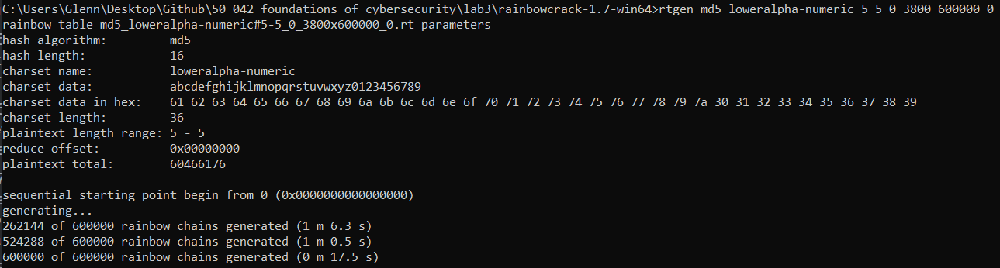

# 2. Hashing password using MD5


# 3. Break Hash: Brute-forcing 

## 3.1 Preparing the possible inputs to be permutated 

Getting a string of letters

Link: https://stackoverflow.com/questions/17182656/how-do-i-iterate-through-the-alphabet

```python
for c in ascii_lowercase:
    test_string += c
print("The test string is {}".format(test_string))
```

Getting all the digits 

Link:https://www.geeksforgeeks.org/python-string-digits/

```python
import string  
result = string.digits  
print(result) 
# 0123456789
```

## 3.2 Reading the file

Link: https://stackoverflow.com/questions/12330522/reading-file-without-newlines-in-python

Problem is that there is a new line character at the end and we want to remove it 

```python
with open("hash5.txt") as f: 
    hash_ls = [line.rstrip('\n') for line in f]
```


## 3.3 Timing the script 

Link:https://stackoverflow.com/questions/1557571/how-do-i-get-time-of-a-python-programs-execution

```python
import time
start_time = time.time()
main()
print("--- %s seconds ---" % (time.time() - start_time))
```

## 3.4 Getting all possible combinations from letters and numbers

Link: https://docs.python.org/2/library/itertools.html

```python
product('ABCD', repeat=2)
# [(A, A), (A, B), (A, C), (A, D), (B, A), (B, B), (B, C), (B, D), (C, A), (C, B), (C, C), (C, D), (D, A), (D, B), (D, C), (D, D)]
```

## 3.5 Converting a tuple to a string

Link: https://www.geeksforgeeks.org/python-program-to-convert-a-tuple-to-a-string/

```python
indiv_combinations = ('G', 'C')
indiv_combinations = ''.join(indiv_combinations)
```

## 3.6 Hashing and getting a message digest

Link: https://docs.python.org/2/library/hashlib.html

<u>**Some errors encountered and how to solve them**</u>

How to correct TypeError: Unicode-objects must be encoded before hashing?

- https://stackoverflow.com/questions/7585307/how-to-correct-typeerror-unicode-objects-must-be-encoded-before-hashing

```python
line.encode('utf-8')
```

**TypeError: object supporting the buffer API required**

Here we need to update the after encoding 

```python
a.update(encoded_combination)
```

<u>**Final solution that works**</u>

- Hash everything 
- For each we store the hash as the key and the original string as the value

```python
indiv_combinations = ''.join(indiv_combinations)
    a = hashlib.new('md5')
    encoded_combination = indiv_combinations.encode('utf-8')
    a.update(encoded_combination)
    hashed_string = a.hexdigest()
    mapping[hashed_string] = indiv_combinations
```

## 3.7 Using the mapping to look up the password

```python
for indiv_hash in hash_ls:
    try:
        answer_ls.append(mapping[indiv_hash])
    except:
        answer_ls.append('error')

print(answer_ls)
# ['opmen', 'tthel', 'cance', 'nized', 'tpoin', 'aseas', 'dsmto', 'egunb', 'mlhdi', 'ofror', 'hed4e', 'di5gv', 'owso9', 'sso55', 'lou0g']
```

## 3.8 Final results


# 4. Creating rainbow tables

## 4.1 Installing rainbow gen

<u>**Step 1**</u>

Download the zip file from http://project-rainbowcrack.com/rainbowcrack-1.7-linux64.zip

**<u>Step 2</u>**

Unzip 

```bash
unzip rainbowcrack-1.7.1-linux64.zip
```

<u>**Step 3**</u>

Change permissions

```
chmod u=rwx rainbowcrack-1.7-linux64
```

## 4. 2 Understanding rtgen

Link: http://project-rainbowcrack.com/generate.htm

Syntax 

```
rtgen hash_algorithm charset plaintext_len_min plaintext_len_max table_index chain_len chain_num part_index
```

- hash_algorithm in this lab is `md5`
- charset. In this lab we use `loweralpha-numeric` since we are restricted to that set 
- plaintext_len_min: Smallest string in the input text
- plaintext_len_max: Largest string in the input text 
- table_index: The table_index parameter selects the reduction function.
- chain_len: This is the rainbow chain length. 
- chain_num: Number of rainbow chains to generate. Size of each rainbow chain is 16 bytes.s
- part_index: To store a large rainbow table in many smaller files, use different number in this parameter for each part and keep all other parameters identical.

## 4.3 Using the lab's rtgen

Ubuntu

- Cd  into the rainbow folder and then run the command

```
./rtgen md5 loweralpha-numeric 5 5 0 3800 600000 0
```


Windows

```
rtgen md5 loweralpha-numeric 5 5 0 3800 600000 0
```



## 4.4 Using rtsort

About a rainbow table

- Rainbow table is an array of rainbow chains. Each rainbow chain has a start point and an end point. 

About rtsort

- The rtsort program sorts the rainbow chains by end point to make binary search possible.

About the command 

- Run following command to sort all .rt rainbow tables in current directory

WARNING

- Never interrupt the rtsort program; otherwise the rainbow table being sorted may be damaged.
- If free memory size is smaller than the size of rainbow table being sorted, temporary hard disk space as large as the rainbow table size is needed to store intermediate results.

Unfortunately, this command did not work for me on the Ubuntu side 

```
rtsort .
```

Windows

- The command is the same

```
rtsort . 
```


## 4.5 Using rcrack

```
rcrack ./ -l ../hash5.txt
```


# 5.Salting

## 5.1 Creating the salted hashes

### 5.1.1 Appending the random lower case letter

Link:https://pynative.com/python-generate-random-string/ 

- remember to use a seed so that our data can be replicated

```python
from string import ascii_lowercase
import random

random.seed(1)

letters = ascii_lowercase
indiv_values += random.choice(letters)
```

## 5.2 Creating a new rainbow table

Some changes

- `plaintext_len_min` and `plaintext_len_max`: These values are 6
- The number of possible combinations are 26<sup>6</sup>=308 915 776
- The chain length and chain number at its current amount should be sufficient 

```
rtgen md5 loweralpha-numeric 6 6 0 3800 600000 0
```

Then remember to sort

```
rtsort . 
```

This time when cracking we need to change the file path

```
rcrack ./ -l ../salted6.txt
```

Result


## 5.3 Adding more rainbow tables

### 5.3.1 Changing the reduction function

<u>**Change the reduction function to 1**</u>

```
rtgen md5 loweralpha-numeric 6 6 1 3800 600000 0
```

Result

- The result improves as now there are only 3 not found
- Notice that it says that 2 rainbow tables are being used now 


<u>**Create another rainbow table with reduction function as 2**</u>

```
rtgen md5 loweralpha-numeric 6 6 2 3800 600000 0
```

Result


### 5.3.2 Reduction table

|      | 0 (10/15) | 1 (8/15) | 2 (6/15) | 3 (9/15) | 4 (5/15) | 5 (10/15) | 6 (11/15) |
| ---- | --------- | -------- | -------- | -------- | -------- | --------- | --------- |
| 1    | Y         |          |          |          |          | Y         | Y         |
| 2    | Y         | Y        | Y        | Y        |          | Y         |           |
| 3    | Y         | Y        |          | Y        |          | Y         | Y         |
| 4    | Y         |          | Y        | Y        | Y        | Y         | Y         |
| 5    | Y         | Y        |          |          | Y        |           | Y         |
| 6    | Y         | Y        | Y        | Y        |          | Y         | Y         |
| 7    | Y         |          |          |          |          |           | Y         |
| 8    |           |          | Y        |          |          | Y         |           |
| 9    | Y         | Y        |          |          | Y        | Y         | Y         |
| 10   | Y         | Y        | Y        | Y        |          | Y         | Y         |
| 11   |           | Y        |          | Y        |          |           | Y         |
| 12   |           | Y        |          | Y        |          | Y         |           |
| 13   |           |          |          |          | Y        |           |           |
| 14   | Y         |          | Y        | Y        | Y        |           | Y         |
| 15   |           |          |          | Y        |          | Y         | Y         |

## 5.4 Getting the result

- In the end, I used reduction functions 4, 5, 6 to get the final answer

For the full generation

```
rtgen md5 loweralpha-numeric 6 6 4 3800 600000 0
rtgen md5 loweralpha-numeric 6 6 5 3800 600000 0
rtgen md5 loweralpha-numeric 6 6 6 3800 600000 0
rtsort . 
rcrack ./ -l ../salted6.txt
```


# 6. Hash competition

Strategy: Get a text file of all passwords, hash them, create a dictionary and do mapping

## 6.1 Iteration 1 - Huge Text List

https://github.com/danielmiessler/SecLists/blob/master/Passwords/Common-Credentials/10-million-password-list-top-1000000.txt

Result: 25% 

```
,hashedValue,unhashed
0,3f71999846f908ed9897eeada2399c95,error
1,3f7d43553778f28cc4f2ba00598d0653,error
2,52b2d1ad30dc855e46a484abb180d325,error
3,8632c375e9eba096df51844a5a43ae93,security1
4,41fb027d1c23536f9e0b2dde019e1a37,error
5,4060e28193d36aeb17dff58ecd2f4e1d,error
6,ab56b4d92b40713acc5af89985d4b786,abcde
7,72b302bf297a228a75730123efef7c41,banana
8,91546a5fca4feda2b837e4ad3e38fcb3,error
9,fe01d67a002dfa0f3ac084298142eccd,orange
10,0c5616c3772c470c9ea847e3ce4079dc,error
11,5213097ccbffbfd3dd262860a3c15afc,alamak
12,d606757a9c50dedc85e3cc90949b10ae,makan
13,2ab96390c7dbe3439de74d0c9b0b1767,hunter2
14,27c07e1c9bcd1ac7e5e995ed92534d77,skittles
15,c3cb0e6b73ed4ea1103257ac539a015a,error
16,82210e61e8f415525262575b20fae48d,treasure
17,c822c1b63853ed273b89687ac505f9fa,google
18,4e7e00ce3e827e48d68f3309dabbb1db,error
19,7c6a180b36896a0a8c02787eeafb0e4c,password1
20,417432b93db6d7654c9612c2cc37dedd,error
21,84df077bcb1bd39ab1a3294de0cf655b,skeleton
22,463ce859c76afb3b13b40298c2cd4683,error
23,981d304c3f23f463adfefc42028f7f0c,error
24,01c92d3c5e470cbc71b8a461b0ecff53,error
25,a5c9b509c134142fbfe0276c22ffa4be,genghis
26,efa88170397c87c264cb471f3cf86e6d,error
27,c0234d550092e8d9b2f42d27f7db0c15,error
28,b13842a079220e73cfbce551dc89f5d5,error
29,dd4137338f84fd1252351375305b847c,error
30,e99a18c428cb38d5f260853678922e03,abc123
31,3e4f2b8d612f26bb4f26fbf3d958fa00,error
32,912ec803b2ce49e4a541068d495ab570,asdf
33,827ccb0eea8a706c4c34a16891f84e7b,12345
34,fc3b604ff70fb679bdb03ef82427a419,error
35,e10adc3949ba59abbe56e057f20f883e,123456
36,9443b0fceb8c03b6a514a706ea69df0b,donkey
37,5f4dcc3b5aa765d61d8327deb882cf99,password
38,23ec24c5ca59000543cee1dfded0cbea,sheep
39,dd7ee3bfea94a9af1d0495e3e2efd339,error
40,a74a7e6ceb925821979eed0659939b13,error
41,6eea9b7ef19179a06954edd0f6c05ceb,qwertyuiop
42,b497dd1a701a33026f7211533620780d,drowssap
43,26cae7718c32180a7a0f8e19d6d40a59,facebook
44,f46565ba900fb8fb166521bd4bb6e2e7,error
45,0d107d09f5bbe40cade3de5c71e9e9b7,letmein
46,df77a58e5fd82336aec7365b36ab95ff,error
47,5ebe2294ecd0e0f08eab7690d2a6ee69,secret
48,1660fe5c81c4ce64a2611494c439e1ba,jennifer
49,58b4e38f66bcdb546380845d6af27187,qwerty1234
50,79464212afb7fd6c38699d0617eaedeb,television
51,dca27e8a94eac4010ae86ccd15c75447,error
52,c37bf859faf392800d739a41fe5af151,98765
53,020d69ec2ee5b3f192483936e2c7f561,error
54,7f59a125a3f57ff02c3691b7a829b837,error
55,5ae3203519771859a4ccd812331951e4,error
56,60411a034de00aa34800cabc37a9e4be,error
57,6cd1e21cf8e989f9fc662c40b0d80294,error
58,d8578edf8458ce06fbc5bb76a58c5ca4,qwerty
59,f30aa7a662c728b7407c54ae6bfd27d1,hello123
60,dd94a5f9059f30fa92ab9c5d107788cb,error
61,7d9ad0211d6493e8d55a4a75de3f90a1,nintendo
62,1a462c628ff3c9ba3ed4af6b692ae1fb,error
63,342f5c77ed008542e78094607ce1f7f3,error
64,9ac401b848ce079f0404f417b092c929,error
65,7babea040123565932f751d938efc5c5,error
66,8621ffdbc5698829397d97767ac13db3,dragon
67,1037d5106b20aafac8809012af0dac70,error
68,482c811da5d5b4bc6d497ffa98491e38,password123
69,4297f44b13955235245b2497399d7a93,123123
70,6ee20298b4f899d0af9f7f04b342f332,error
71,53fe99e9c93fdd5fc14e296375b85b43,error
72,8a8ed1d1160152f7656f5e823a8bdffa,error
73,c4ee758b17ed3c864d27b436fc46d65a,error
74,347cfaab0130261f134e9593c85caf93,error
75,62a4561c731e19b63bc9a4929bbb5f87,error
76,2741f0a592772d52835003128a900350,error
77,57e507f55beaf31e85f298af9b3d6bb4,error
78,3805248410673a8be6aa4807e61fb5ae,poiuytrewq
79,3ab30dfdf113efe9b719ce5763d75446,error
80,9ded7fab83986b60bdbb4a75dab019bb,error
81,5940eb65c060cebb4df6914f5af39cfe,error
82,f8cacbcdcbf93f6238285139e0f8284b,error
83,4698e7ab9c06649f06f3bbc8fcb20360,error
84,0b47dd2352d12f5bce760ddfa2ef7849,error
85,696d29e0940a4957748fe3fc9efd22a3,error
86,daac6467d1d7cb418572dbd8d01c190a,error
87,3fb36ec3b05979c3544306386a2c8857,error
88,1897a69ef451f0991bb85c6e7c35aa31,1a2b3c4d
89,987dce6fd25b25c278ceb48b23699dc7,error
90,700055094032bf4942fa3f670d5330f5,error
91,f4b5ad38c48310e80be31c9f74a3ff48,error
92,d5af1d13cfbcc5e08796f09da37ddc2d,error
93,af27d1863513c3e2b8490500f8ade244,error
94,4873cb77ec54c0aa1ea6ababf03bd774,error
95,b00ad229e995d970090791de535759da,error
96,1e46805eff2b78c440e88cd8d4cce788,error
97,fb38ab49398741224bca4259a6094c24,error
98,0239181e4d9c76a12e60675013ff4376,dogsandcats
99,8f4d5fe00d95218527683d4df55450de,error
100,e9f5bd2bae1c70770ff8c6e6cf2d7b76,error
101,dfd6ea93226701b6d8789e4988f0d400,error
102,8b2d6d8c68b069ea1c27308cd4b3d3ac,error
103,c83a9421fa0eefec6c86001baa65568a,error
104,b9cba343ab1df65293bcd23e668c7179,error
105,a0cc3ee999ec0c60dc75ebb1448e2aaa,error
106,59cae021a199e3a109d4e1d4eb06f454,error
107,318e2407a82f72b01d61ab1c52a719b2,error
108,354754c0925e6bd6338f4fbaee43e87e,error
109,cf9335aa407b76812d6fe661de163756,error
110,d768d3b271ba9faaab0141600a47b221,error
111,b419e81184e9492a74d9646e23ebc82d,error
112,d9dd40eb4d0e510e2d5b7fe3dc529d3f,error
113,ac33c7d806f98d4e3f91240c6de301fd,error
114,3d5cfea66d40e5446a3ef7737398ac2e,error
115,37e2542cfc084f9b09e4a5784c9dd5d5,error
116,dcfe89040ba34e8ea4ffb04966e04f04,error
117,8b778d3883fbe0615b3a53a600d0ba63,error
118,887f219f4cd6af1af61d20b687fed01c,error
119,cb6343e0f08bd6526dcf7d56509eb395,error
120,9c0192571dbfb2c3a822dba9cab7d934,error
121,ade19e33351c5ef7923b0fcecac5efe8,error
122,d8ac58762deeebe560ae4b239cf224ba,error
123,4ece57a61323b52ccffdbef021956754,error
124,3678aa3abfa400f91e7c479d55297801,error
125,65f688749305a936a5964de0dd5f2a7f,error
126,d54b17e4795c706a6738700a548df92f,error
127,1fc7f8989d2d6812d037b1fb2814bf54,error
128,d1fdfebfd5a4fa30644a40c042856e87,error
129,c8b0fca2c59d9198b641ce60fe9b501b,error
130,007b046e53a5fddd93b5928e364c6992,error
131,2ad84a2be1efcc4972c1f3a2c1b620ce,error
132,838035512013076935bdf26c70895458,error
133,6c18c944a312efb2df7811fadecd8331,error
134,673065f07d250adfcc7c6162fc0bd150,error
135,5b3294dd5bc8345e63dc0a27ba74d256,error
136,cc74c1cf76412cf024b84da7254ecbcd,error
137,5277e47f8ec27676839fba3b338e7018,error
138,cb759b84b038e9872056456e647a29df,error
139,f2333057efa355f124ca224a56c19604,error
140,be2b792b0264009a9106d27abe69ded4,error
141,ca0c9e4f47ace3423b150207f49d4911,error
142,4cc2012ab57f76bb2d95b6dbe0cd3704,error
143,51edb74f2f83d7e5f155622056f8a79a,error
144,1a65b9b6764a850a0d197066ef7426c4,error
145,a62632534dfc6801df0fb8b7b272a38e,error
146,60abe3e25b19739b3a213f2646183a77,error
147,72deac1f7a7b70ead34b017fa0676b9b,error

```

## 6.2  Iteration 2

Making a Get request

Link 1: https://md5decrypt.net/en/Api/

Result: 142/148

Unidentified hashes: 

- 4698e7ab9c06649f06f3bbc8fcb20360
- daac6467d1d7cb418572dbd8d01c190a
- d5af1d13cfbcc5e08796f09da37ddc2d
- d768d3b271ba9faaab0141600a47b221
- 007b046e53a5fddd93b5928e364c6992
- 5b3294dd5bc8345e63dc0a27ba74d256

Link 2: https://hashkiller.co.uk/Cracker/MD5

Result: 145/148

Unidentified hashes

- 4698e7ab9c06649f06f3bbc8fcb20360
- daac6467d1d7cb418572dbd8d01c190a
- d768d3b271ba9faaab0141600a47b221F

# Miscellaneous

Change directory to the directory with the python file

```
cd /mnt/c/Users/Glenn/Desktop/Github/50_042_foundations_of_cybersecurity/lab3 
```

