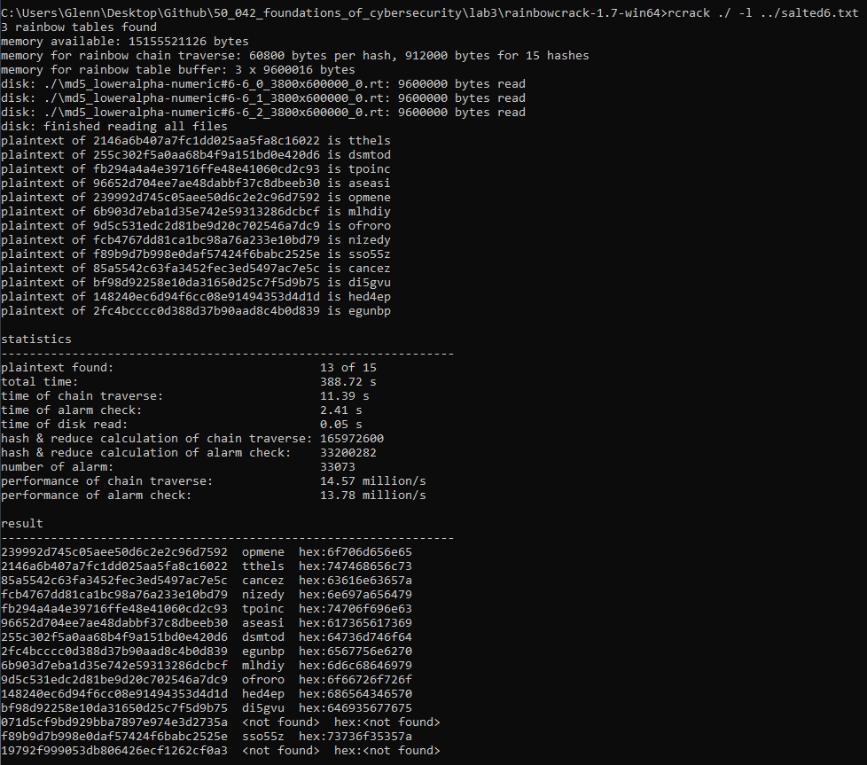

# 2. Hashing password using MD5


# 3. Break Hash: Brute-forcing 

## 3.1 Preparing the possible inputs to be permutated 

Getting a string of letters

Link: https://stackoverflow.com/questions/17182656/how-do-i-iterate-through-the-alphabet

```python
for c in ascii_lowercase:
    test_string += c
print("The test string is {}".format(test_string))
```

Getting all the digits 

Link:https://www.geeksforgeeks.org/python-string-digits/

```python
import string  
result = string.digits  
print(result) 
# 0123456789
```

## 3.2 Reading the file

Link: https://stackoverflow.com/questions/12330522/reading-file-without-newlines-in-python

Problem is that there is a new line character at the end and we want to remove it 

```python
with open("hash5.txt") as f: 
    hash_ls = [line.rstrip('\n') for line in f]
```


## 3.3 Timing the script 

Link:https://stackoverflow.com/questions/1557571/how-do-i-get-time-of-a-python-programs-execution

```python
import time
start_time = time.time()
main()
print("--- %s seconds ---" % (time.time() - start_time))
```

## 3.4 Getting all possible combinations from letters and numbers

Link: https://docs.python.org/2/library/itertools.html

```python
product('ABCD', repeat=2)
# [(A, A), (A, B), (A, C), (A, D), (B, A), (B, B), (B, C), (B, D), (C, A), (C, B), (C, C), (C, D), (D, A), (D, B), (D, C), (D, D)]
```

## 3.5 Converting a tuple to a string

Link: https://www.geeksforgeeks.org/python-program-to-convert-a-tuple-to-a-string/

```python
indiv_combinations = ('G', 'C')
indiv_combinations = ''.join(indiv_combinations)
```

## 3.6 Hashing and getting a message digest

Link: https://docs.python.org/2/library/hashlib.html

<u>**Some errors encountered and how to solve them**</u>

How to correct TypeError: Unicode-objects must be encoded before hashing?

- https://stackoverflow.com/questions/7585307/how-to-correct-typeerror-unicode-objects-must-be-encoded-before-hashing

```python
line.encode('utf-8')
```

**TypeError: object supporting the buffer API required**

Here we need to update the after encoding 

```python
a.update(encoded_combination)
```

<u>**Final solution that works**</u>

- Hash everything 
- For each we store the hash as the key and the original string as the value

```python
indiv_combinations = ''.join(indiv_combinations)
    a = hashlib.new('md5')
    encoded_combination = indiv_combinations.encode('utf-8')
    a.update(encoded_combination)
    hashed_string = a.hexdigest()
    mapping[hashed_string] = indiv_combinations
```

## 3.7 Using the mapping to look up the password

```python
for indiv_hash in hash_ls:
    try:
        answer_ls.append(mapping[indiv_hash])
    except:
        answer_ls.append('error')

print(answer_ls)
# ['opmen', 'tthel', 'cance', 'nized', 'tpoin', 'aseas', 'dsmto', 'egunb', 'mlhdi', 'ofror', 'hed4e', 'di5gv', 'owso9', 'sso55', 'lou0g']
```

## 3.8 Final results


# 4. Creating rainbow tables

## 4.1 Installing rainbow gen

<u>**Step 1**</u>

Download the zip file from http://project-rainbowcrack.com/rainbowcrack-1.7-linux64.zip

**<u>Step 2</u>**

Unzip 

```bash
unzip rainbowcrack-1.7.1-linux64.zip
```

<u>**Step 3**</u>

Change permissions

```
chmod u=rwx rainbowcrack-1.7-linux64
```

## 4. 2 Understanding rtgen

Link: http://project-rainbowcrack.com/generate.htm

Syntax 

```
rtgen hash_algorithm charset plaintext_len_min plaintext_len_max table_index chain_len chain_num part_index
```

- hash_algorithm in this lab is `md5`
- charset. In this lab we use `loweralpha-numeric` since we are restricted to that set 
- plaintext_len_min: Smallest string in the input text
- plaintext_len_max: Largest string in the input text 
- table_index: The table_index parameter selects the reduction function.
- chain_len: This is the rainbow chain length. 
- chain_num: Number of rainbow chains to generate. Size of each rainbow chain is 16 bytes.s
- part_index: To store a large rainbow table in many smaller files, use different number in this parameter for each part and keep all other parameters identical.

## 4.3 Using the lab's rtgen

Ubuntu

- Cd  into the rainbow folder and then run the command

```
./rtgen md5 loweralpha-numeric 5 5 0 3800 600000 0
```


Windows

```
rtgen md5 loweralpha-numeric 5 5 0 3800 600000 0
```


## 4.4 Using rtsort

About a rainbow table

- Rainbow table is an array of rainbow chains. Each rainbow chain has a start point and an end point. 

About rtsort

- The rtsort program sorts the rainbow chains by end point to make binary search possible.

About the command 

- Run following command to sort all .rt rainbow tables in current directory

WARNING

- Never interrupt the rtsort program; otherwise the rainbow table being sorted may be damaged.
- If free memory size is smaller than the size of rainbow table being sorted, temporary hard disk space as large as the rainbow table size is needed to store intermediate results.

Unfortunately, this command did not work for me on the Ubuntu side 

```
rtsort .
```

Windows

- The command is the same

```
rtsort . 
```


## 4.5 Using rcrack

```
rcrack ./ -l ../hash5.txt
```


# 5.Salting

## 5.1 Creating the salted hashes

### 5.1.1 Appending the random lower case letter

Link:https://pynative.com/python-generate-random-string/ 

- remember to use a seed so that our data can be replicated

```python
from string import ascii_lowercase
import random

random.seed(1)

letters = ascii_lowercase
indiv_values += random.choice(letters)
```

## 5.2 Creating a new rainbow table

Some changes

- `plaintext_len_min` and `plaintext_len_max`: These values are 6
- The number of possible combinations are 26<sup>6</sup>=308 915 776
- The chain length and chain number at its current amount should be sufficient 

```
rtgen md5 loweralpha-numeric 6 6 0 3800 600000 0
```

Then remember to sort

```
rtsort . 
```

This time when cracking we need to change the file path

```
rcrack ./ -l ../salted6.txt
```

Result


## 5.3 Adding more rainbow tables

### 5.3.1 Changing the reduction function

<u>**Change the reduction function to 1**</u>

```
rtgen md5 loweralpha-numeric 6 6 1 3800 600000 0
```

Result

- The result improves as now there are only 3 not found
- Notice that it says that 2 rainbow tables are being used now 


<u>**Create another rainbow table with reduction function as 2**</u>

```
rtgen md5 loweralpha-numeric 6 6 2 3800 600000 0
```

Result



### 5.3.2 Reduction table

|      | 0 (10/15) | 1 (8/15) | 2 (6/15) | 3 (9/15) | 4 (5/15) | 5 (10/15) | 6 (11/15) |
| ---- | --------- | -------- | -------- | -------- | -------- | --------- | --------- |
| 1    | Y         |          |          |          |          | Y         | Y         |
| 2    | Y         | Y        | Y        | Y        |          | Y         |           |
| 3    | Y         | Y        |          | Y        |          | Y         | Y         |
| 4    | Y         |          | Y        | Y        | Y        | Y         | Y         |
| 5    | Y         | Y        |          |          | Y        |           | Y         |
| 6    | Y         | Y        | Y        | Y        |          | Y         | Y         |
| 7    | Y         |          |          |          |          |           | Y         |
| 8    |           |          | Y        |          |          | Y         |           |
| 9    | Y         | Y        |          |          | Y        | Y         | Y         |
| 10   | Y         | Y        | Y        | Y        |          | Y         | Y         |
| 11   |           | Y        |          | Y        |          |           | Y         |
| 12   |           | Y        |          | Y        |          | Y         |           |
| 13   |           |          |          |          | Y        |           |           |
| 14   | Y         |          | Y        | Y        | Y        |           | Y         |
| 15   |           |          |          | Y        |          | Y         | Y         |

## 5.4 Getting the result

- In the end, I used reduction functions 4, 5, 6 to get the final answer

For the full generation

```
rtgen md5 loweralpha-numeric 6 6 4 3800 600000 0
rtgen md5 loweralpha-numeric 6 6 5 3800 600000 0
rtgen md5 loweralpha-numeric 6 6 6 3800 600000 0
rtsort . 
rcrack ./ -l ../salted6.txt
```


# Miscellaneous

Change directory to the directory with the python file

```
cd /mnt/c/Users/Glenn/Desktop/Github/50_042_foundations_of_cybersecurity/lab3 
```

