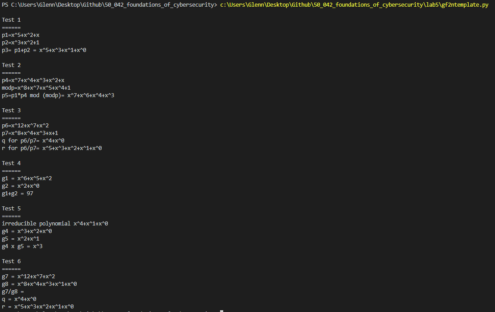

# Glenn Chia 1003118

50.042 Foundations of Cybersecurity Lab 5

# 1. Create a table for addition and multiplication for GF(24), using (x4 + x3+ 1) as the modulus.

For this test case we will use 

- g4 = x3+x2+1  
- g5 = x2+x

| Row  | Powers                        | Operation                         | New Result                    | Reduction | After reduction (XOR) |
| ---- | ----------------------------- | --------------------------------- | ----------------------------- | --------- | --------------------- |
| 1    | x0 . g4 |                                   | x3+x2+1 | N         |                       |
| 2    | x1 . g4 | x . x3+x2+1 | x4+x3+x | Y         | x + 1                 |
| 3    | x2 . g4 | x . x+1                           | x2+x               | N         |                       |

We then take the `After reduction` results associated with row 2, 3

Result = (x2 + x) + (x+1)  = x2+1

**Addition table**

|                   | x0 | x1 | x2 | x3 |
| ----------------- | ------------- | ------------- | ------------- | ------------- |
| x2 + x | 0             | 1             | 1             | 0             |
| x+1               | 1             | 1             | 0             | 0             |
| Result            | 1             | 0             | 1             | 0             |

Result is x2+1

# 2. Second example with a different GF(2n)

For this part we will use the test case to illustrate

- p1 = x5+x2+x  
- p4 = x7+x4+x3+x2+x  
- modp = x8+x7+x5+x4+1

| Row  | Powers                        | Operation                                                    | New Result                                                   | Reduction | After reduction (XOR)                                        |
| ---- | ----------------------------- | ------------------------------------------------------------ | ------------------------------------------------------------ | --------- | ------------------------------------------------------------ |
| 1    | x0 . P4 |                                                              | x7+x4+x3+x2+x    | N         |                                                              |
| 2    | x1 . P4 | x . x7+x4+x3+x2+x | x8+x5+x4+x3+x2 | Y         | x7+x3+x2+1                  |
| 3    | x2 . P4 | x . x7+x3+x2+1              | x8+x4+x3+x                  | Y         | x7+x5+x3+x+1                |
| 4    | x3 . P4 | x . x7+x5+x3+x+1            | x8+x6+x4+x2+x    | Y         | x7+x6+x5+x2+x+1  |
| 5    | x4 . P4 | x . x7+x6+x5+x2+x+1 | x8+x7+x6+x3+x2+x | Y         | x6+x5+x4+x3+x2+x+1 |
| 6    | x5 . P4 | x . x6+x5+x4+x3+x2+x+1 | x7+x6+x5+x4+x3+x2+x | N         |                                                              |

We then take the `After reduction` results associated with row 2, 3, 6

Result = (x7+x3+x2+1) + (x7+x5+x3+x+1) + (x7+x6+x5+x4+x3+x2+x) = x7+x6+x4+x3

**Addition table** 

Doing the first addition

|                                               | x0 | x1 | x2 | x3 | x4 | x5 | x6 | x7 |
| --------------------------------------------- | ------------- | ------------- | ------------- | ------------- | ------------- | ------------- | ------------- | ------------- |
| x7+x3+x2+1   | 1             |               | 1             | 1             |               |               |               | 1             |
| x7+x5+x3+x+1 | 1             | 1             |               | 1             |               | 1             |               | 1             |
| Result                                        | 0             | 1             | 1             | 0             | 0             | 1             | 0             | 0             |

Doing the second addition

|                                                              | x0 | x1 | x2 | x3 | x4 | x5 | x6 | x7 |
| ------------------------------------------------------------ | ------------- | ------------- | ------------- | ------------- | ------------- | ------------- | ------------- | ------------- |
| x5+x2+x                                |               | 1             | 1             |               |               | 1             |               |               |
| x7+x6+x5+x4+x3+x2+x |               | 1             | 1             | 1             | 1             | 1             | 1             | 1             |
| Result                                                       | 0             | 0             | 0             | 1             | 1             | 0             | 1             | 1             |

The result is x7+x6+x4+x3

# 3. Lab's test case

