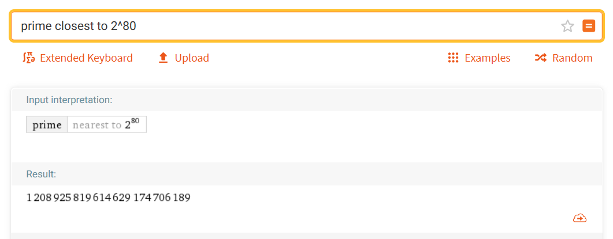
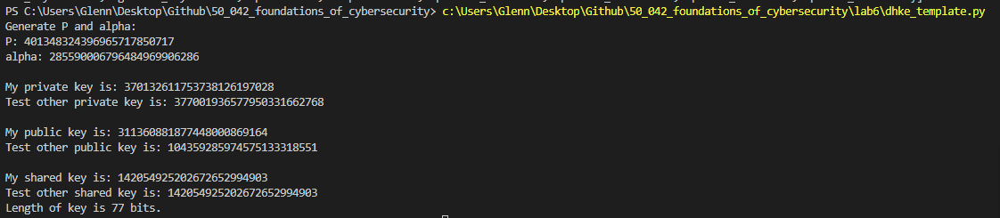

# 1. Part I: Implementing Square and Multiply

## 1.1 Square and multiply pseudo code is given in the notes

- Convert the integer to binary and convert that to a string so we can strip the `0b` at the front
- Note that in the for loop of square and multiply we start from the MOST SIGNIFICANT BIT

## 1.2 miller_rabin

Pseudo code can be found on [https://en.wikipedia.org/wiki/Miller%E2%80%93Rabin_primality_test](https://en.wikipedia.org/wiki/Miller–Rabin_primality_test) 

Generating a random number in a range 

-  https://docs.python.org/2/library/random.html 
- `random.randint(a, b)` - Return a random integer *N* such that `a <= N <= b`.

Illustrating a prime number example 61 with 2 rounds

1. First we need to find r and d based on 61-1=60
2. 2<sup>2</sup> * 15 = 60.
   1. r = 2
   2. d = 15
3. Enter the first iteration of the loop
   1. Pick a random integer a between 2 and 61-2=59
   2. Let's say we choose 5
   3. x = 5<sup>15</sup>%61 = 60
   4. Check condition. If x=1 or x=n-1=60 we continue the loop. Since x=60 we thus continue with the loop. On to the second iteration
4. Second iteration of the loop
   1. This time we choose a=7
   2. x =  7<sup>15</sup>%61 = 11
   3. Check condition. If x=1 or x=n-1=60 we continue the loop but it is not
   4. Now we repeat r-1 times which is just 1 time
      1. x = 11<sup>2</sup>%61 = 60
      2. Check if x=n-1=60
      3. Since it is, we continue with the loop 
5. BUT, the loop is finished already
6. Hence the number is a prime number 

## 1.3 Generating prime numbers

For an n bit binary, the greatest number is 2<sup>n</sup>-1 but if there is 100 bits, this value is 1.2676505x10<sup>30</sup>

With this random number generated we check if it is prime. If it is, we return it, else we generate a new number and continue the loop

To speed up finding a prime number, we can first generate an n bit odd number with `2 * random.randint(1, 2**(n - 1) - 1) + 1`

# 2. Part II: Diffie-Hellman Key Exchange (DHKE)

## 2.1 Getting a prime number

Go to http://www.wolframalpha.com/ and type `prime closest to 2^80` 


- I get an integer `1208925819614629174706189`

For the alpha the lab says that it must be a primitive element or generator in the group. Since the group is not provided, we just pick an alpha between 2 and p-2 (inclusive)

The week 6 slides says the following

- 2 public parameters
  - We have a large prime `p`
  - Some integer `g`
- Choose a random private number a
- Announce g<sup>a</sup> mod p 
- Attacker cannot find a from g<sup>a</sup> mod p 
- Given finite cyclic group G of order p-1 and an element r, and a (multiplicative) generator element g

# 3. Part III: Baby-Step Giant-Step Method

The algorithm is provided in the notes. The only thing to note is that we must use the `square and multiply` function that we coded or the inbuilt `pow` function.

Baby-Step Giant-step utilizes the following to compute the private key

- Known large prime p 
- Known public keys which in this lab is called beta
- alpha which is a primitive element or generator in the group. Question: How do they find out what this is? In the notes this alpha is actually `g` which is the integer chosen between the 2 parties and is public information. Essentially we are solving x = log<sub>g</sub><sup>r</sup> mod p 

If we rewrite the formula in the lab we are doing

- Group order is the number of elements in the group not including 0. Since we know that the mod is a mod by p, anything mod by p has values ranging from 0 to p-1. But since we don't count 0, that range is from 1 to p-1 which has p-1 values.
- m is given by  $\lfloor \sqrt{|group\ order|} \rfloor$ =  $\lfloor \sqrt{|p-1|} \rfloor$ 
- m is the floor of 

> (public_key) * pow(chosen_integer, x_b) = pow(chosen_integer, x_g * m)

At the end we should compute the shared key when we get either private keys 



# 4. Open ended questions

## 4.1 Demo a key exchange using DHKE protocol

For this question I worked with Tan Yi Xuan (1002887) where he was the server and I was the client 

The steps we took are as follows

1. We both decided on a common p and a 

   1. p = 1208925819614629174706189
   2. $\alpha$ = 2

2. We then each generated our private keys using `random.randint(2, p-2)` 

3. We then computed our respective public keys by taking the square multiple of $\alpha$ and private key with mod p

4. Since I was the client, I connected to his server

   ```python
   with socket.socket(socket.AF_INET, socket.SOCK_STREAM) as s:
       s.connect((HOST, PORT))
   ```

5. I then initiated the session by sending him my public key. We choose 10 because the key is 80 bits or 10 bytes

   ```python
   s.sendall(A.to_bytes(10, 'big'))
   ```

6. he then sent me back his public key which I receive

   ```python
   B = int.from_bytes(s.recv(10), 'big')
   ```

7. We each then computed the shared key. With the shared key I then encrypted a message 

   ```python
   sharedKeyA=get_shared_key(B,a,p)
   encrypted_message= ecb.ecb(b'hello yx', sharedKeyA, 'e')
   ```

8. I then sent the length of the message so he knew when to stop reading and then I sent the message

   ```python
   s.send(len(encrypted_message).to_bytes(4, 'big'))
   s.send(encrypted_message)
   ```

9. He then sent me a response. I received the length of the response, the response and then decrypted it to get the message

   ```python
   receive_length = int.from_bytes(s.recv(4), 'big')
   receive_message = s.recv(receive_length)
   decrypted_message = ecb.ecb(receive_message, sharedKeyA, 'd')
   ```

The result of the exchange is as follows



## 4.2 What's the advantage and disadvantage of DHKE?  

When designing a system, we want to ensure that it provides confidentiality and integrity. These are often trivial to solve with symmetric encryption and MAC. However, there is a problem of key establishment with DHKE effectively solves

**<u>Advantage</u>**

- Allows users to communicate on a public channel 
- Both Alice and Bob contribute to the key's randomness
- In this system we assume the public keys of each user is unique (assume for now that it is hard to crack), this allows users to identify with confidence that Bob is truly Bob
- Since the private keys are unknown to the attacker, the attacker cannot generate the shared key. 
  - Attacker has access to g and p
  - The discrete log problem makes it hard for the attacker to find g<sup>a</sup> mod p
- In addition, Alice and Bob do not have to transfer their private keys and hence only they can compute the shared symmetric key 
- Don't need to use a key distribution center to get the shared key, hence, don't need to trust a third party

**<u>Disadvantage</u>**

- The DHKE is not 100% secure as the attacker can still use a brute force attack of r = g x g x g ... [x times, x=ab] till the attacker computes g<sup>ab</sup>. 
- This is easy if Alice and Bob happen to have small selections for `a` and `b`. However this is unlikely as these private keys are between 2 and to p-2 where p is a very large prime 
- There are also several methods to break the key (though for large `a` and `b` which results in a large shared key makes it hard)
  1. Brute force linear search
  2. Shank's baby-step-giant-step algorithm
  3. Pollard's Rho Method
  4. Pohlig-Hellman method

## 4.3 Increase the number of bits to break slowly. To avoid attack using Baby-Step Giant-Steps method, how many bits should the key be in DHKE protocol?

Baby-step-giant-steps aims to find the private keys. From the private keys, we then compute the shared key as the public key is known.