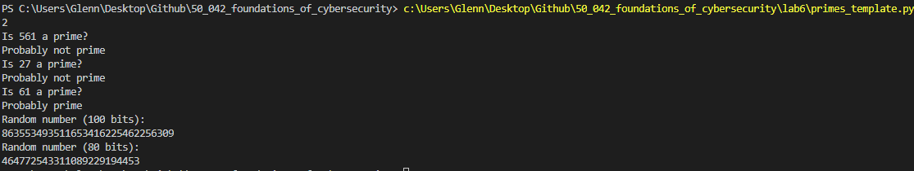

# Glenn Chia 1003118

50.042 Foundations of Cybersecurity Lab 6

# 1. Open ended questions

## 1.1 Demo a key exchange using DHKE protocol

Code for client: `exchange_demo.py`

Code for ECB encryption: `ecb.py`

For this question I worked with Tan Yi Xuan (1002887) where he was the server and I was the client 

The steps we took are as follows

1. We both decided on a common p and a 

   1. p = 1208925819614629174706189
   2. $\alpha$ = 2

2. We then each generated our private keys using `random.randint(2, p-2)` 

3. We then computed our respective public keys by taking the square multiple of $\alpha$ and private key with mod p

4. Since I was the client, I connected to his server

   ```python
   with socket.socket(socket.AF_INET, socket.SOCK_STREAM) as s:
       s.connect((HOST, PORT))
   ```

5. I then initiated the session by sending him my public key. We choose 10 because the key is 80 bits or 10 bytes

   ```python
   s.sendall(A.to_bytes(10, 'big'))
   ```

6. he then sent me back his public key which I receive

   ```python
   B = int.from_bytes(s.recv(10), 'big')
   ```

7. We each then computed the shared key. With the shared key I then encrypted a message 

   ```python
   sharedKeyA=get_shared_key(B,a,p)
   encrypted_message= ecb.ecb(b'hello yx', sharedKeyA, 'e')
   ```

8. I then sent the length of the message so he knew when to stop reading and then I sent the message

   ```python
   s.send(len(encrypted_message).to_bytes(4, 'big'))
   s.send(encrypted_message)
   ```

9. He then sent me a response. I received the length of the response, the response and then decrypted it to get the message

   ```python
   receive_length = int.from_bytes(s.recv(4), 'big')
   receive_message = s.recv(receive_length)
   decrypted_message = ecb.ecb(receive_message, sharedKeyA, 'd')
   ```

The result of the exchange is as follows


## 1.2 What's the advantage and disadvantage of DHKE?  

When designing a system, we want to ensure that it provides confidentiality and integrity. These are often trivial to solve with symmetric encryption and MAC. However, there is a problem of key establishment with DHKE effectively solves

**<u>Advantage</u>**

- Allows users to communicate on a public channel 
- Both Alice and Bob contribute to the key's randomness
- In this system we assume the public keys of each user is unique (assume for now that it is hard to crack), this allows users to identify with confidence that Bob is truly Bob
- Since the private keys are unknown to the attacker, the attacker cannot generate the shared key. 
  - Attacker has access to g and p
  - The discrete log problem makes it hard for the attacker to find g<sup>a</sup> mod p
- In addition, Alice and Bob do not have to transfer their private keys and hence only they can compute the shared symmetric key 
- Don't need to use a key distribution center to get the shared key, hence, don't need to trust a third party

**<u>Disadvantage</u>**

- The DHKE is not 100% secure as the attacker can still use a brute force attack of r = g x g x g ... [x times, x=ab] till the attacker computes g<sup>ab</sup>. 
- This is easy if Alice and Bob happen to have small selections for `a` and `b`. However this is unlikely as these private keys are between 2 and to p-2 where p is a very large prime 
- There are also several methods to break the key (though for large `a` and `b` which results in a large shared key makes it hard)
  1. Brute force linear search
  2. Shank's baby-step-giant-step algorithm
  3. Pollard's Rho Method
  4. Pohlig-Hellman method

## 1.3 Increase the number of bits to break slowly. To avoid attack using Baby-Step Giant-Steps method, how many bits should the key be in DHKE protocol?

Code: `babygiant_vary_bits.py`

Baby-step-giant-steps aims to find the private keys. From the private keys, we then compute the shared key as the public key is known.

The approach was this was to use the DHKE template code to generate different length of shared bits. A larger shared key would mean a naturally larger private key/public key to crack.

I then used the baby-step giant-step code to break it and timed it 

```python
start_time = time.time()
# Break the shared key here 
a=baby_giant(alpha,A,p)
sharedKeyGuess=primes_template.square_multiply(B,a,p)
# Record the time taken
elapsed_time = time.time() - start_time
print(elapsed_time)
```

The results are as shown below


The plot of the results shows 


Using an equation formulator we can get a formula 

> time = 6x10<sup>-5</sup>e<sup>0.4477key_length</sup>

Manipulating the equation gives 

> key_length = 2.233ln($\frac{time}{6.10^{-5}}$)

If we want to make it secure for a day (maybe the client just needs to have a session with the server that lasts for a day)

>  1 day = 86400 seconds
>
>  Key_length = 47 bits

If we want to make it secure enough (meaning that it will take decades to break, maybe 60 years)

>  60 years = 1.892 x 10<sup>9</sup>seconds
>
>  Key_length = 69 bits

This makes sense because a larger p is chosen which in turn determines the size of m and the number of iterations of the for loop.

# 2. Part 1 - primes_template.py



<div style="page-break-after: always;"></div>
# 3. Part 2


# 4. Part 3

