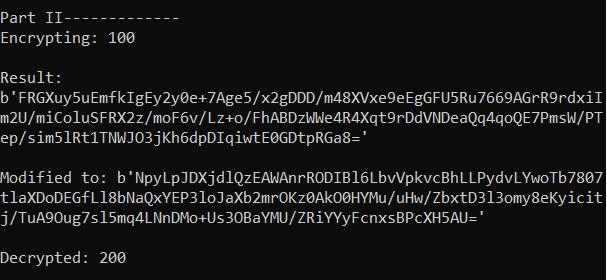

# 1. Installations

1. Helper call to change directory

   ```
   cd C:\Users\Glenn\Desktop\Github\50_042_foundations_of_cybersecurity\lab7
   ```

2. Create a virtual environment

   ```
   python -m venv venv
   ```

3. Activate the virtual environment 

   ```
   venv\Scripts\activate
   ```

4. Install `pycryptodome` since the documentation shows that it supports newer python versions  https://pypi.org/project/pycryptodome/ 

   ```
   pip install pycryptodome
   ```

# 2. Part I

## 2.1 Reading the message

- Note that the original message has a return. If we want to ignore it we can do `readline()` because the file has a return 
- We have to `encode` which has a default encoding of `UTF-8`. If we don't do this, we will get an error `TypeError: string argument without an encoding`

```python
 with open("message.txt") as f_message:
        message = f_message.read().encode()
```

## 2.2 Printing the ciphertext

To print the ciphertext, we need to encode it as without encoding, it will just be numbers printed out on the screen

We encode using `base64.b64encode(s[, altchars])`

The link to the documentation is here  https://www.base64encode.net/python-base64-b64encode 

## 2.3 Results


# 3. Part 2

## 3.1 Using SHA256

Link:  https://pycryptodome.readthedocs.io/en/latest/src/hash/sha256.html 

```python
message_hash = SHA256.new()
message_hash.update(message)
message_hash_digest = message_hash.hexdigest()
```

However, when we pass it into the encryption function, we get the following error: `TypeError: string argument without an encoding` which comes from `b=bytearray(b)`. This is because the string does not have a recognised encoding. Hence, we need to specify that it is encoded by `utf-8`

```python
encrypted_hash = encrypt_RSA('mykey.pem.pub', message_hash_digest.encode(encoding='utf-8'))
```

## 3.2 Results



## 3.2 RSA Digital Signature Protocol Attack

For this lab I partnered Tan Yi Xuan (1002887)

For Alice's public key we used the provided key `mykey.pem.pub`. The code for this part is found in `part2_demo.py`

**<u>For the first round I played Eve's role</u>** 

- Encrypt with the public key and print the `bytearray` version and the `b64encode` 
- Send the `bytearray` version to my partner which happens to be 128 bytes long
- I also send the signature `s`
- My partner then did the same encryption with the same public key (Alice's) and checks that the digest is the same
- It was the same. He then sent me the length of his response (4 bytes) and the response to say that it was ok


```python
with socket.socket(socket.AF_INET, socket.SOCK_STREAM) as sock:
    sock.connect((HOST, PORT))
    '''
        For the first part I am Eve
        I will impersonate Alice and send x (message), s (signature)
        Bob already has Alice's public key, public key(e)
    '''
    print('I AM EVE FOR THIS ROUND\n')
    s = 100 #2019  # 111 11100011
    x = encrypt_RSA('mykey.pem.pub', pyrsa_sq_mul.pack_bigint(s))
    print('Result of encryption with public key:\n{}\n'.format(x))
    print('Result of encryption with public key:\n{}\n'.format(b64encode(x)))
    # Send x length
    sock.send(len(x).to_bytes(4, 'big'))
    print('Sent x length: {}'.format(len(x)))
    # Send x
    sock.sendall(x)
    print('Sent new message x')
    # Send s
    sock.send(len(pyrsa_sq_mul.pack_bigint(s)).to_bytes(4, 'big'))
    sock.sendall(pyrsa_sq_mul.pack_bigint(s))
    print('Sent signature s: {}'.format(s))
    # Receive acknowledgement from partner 
    ## Receive the length of the message
    receive_length = int.from_bytes(sock.recv(4), 'big')
    print('Received message length: {}'.format(receive_length))
    ## Receive message
    receive_message = sock.recv(receive_length)
    if receive_message == b'OK':
        print('ATTACK SUCCESS\n')
    else:
        print('ATTACK FAILED\n')
```

<u>**In the second round I was Bob**</u>

- Partner encrypts with the public key
- I receive the message length (128 bytes) 
- I print the `b64encode` version of the encrypted message
- I receive the length of the signature
- I receive the signature
- I then did the same encryption with the same public key (Alice's) and check that the digest is the same
- It was the same. I then sent the length of his response (4 bytes) and the response to say that it was ok


```python
with socket.socket(socket.AF_INET, socket.SOCK_STREAM) as sock:
        sock.connect((HOST, PORT))
        '''
        For the second part I am Bob
        I will receive x (message), s (signature)
        I already has Alice's public key, public key(e)
        '''
        print('I AM BOB FOR THIS ROUND\n')
        #x_receive_length = sock.recv(4)
        x_receive_length = int.from_bytes(sock.recv(4), 'big')
        print('Receive x length: {}'.format(x_receive_length))
        x_receive = sock.recv(x_receive_length)
        print('Result of encryption with public key received:\n{}\n'.format(b64encode(x_receive)))
        s_receive_length = int.from_bytes(sock.recv(4), 'big')
        print('The length of the s_received is: {}'.format(s_receive_length))
        s_receive = sock.recv(s_receive_length)
        # s_receive_raw = int.from_bytes(s_receive, 'big')
        print('Received plain message:\n{}\n'.format(s_receive))
        s_receive = int.from_bytes(s_receive, 'big')
        s_receive = pyrsa_sq_mul.pack_bigint(s_receive)
        x_receive_prime = encrypt_RSA('mykey.pem.pub', s_receive)
        print('x prime is:\n{}\n'.format(b64encode(x_receive_prime)))
        print('x prime is:\n{}\n'.format(x_receive_prime))
        if x_receive == x_receive_prime:
            response_bob = 'OK'
            print('ATTACK SUCCESS\n')
        else:
            response_bob = 'ERR'
            print('ATTACK FAILED\n')
        sock.send(len(response_bob).to_bytes(4, 'big'))
        print('Sent length of response: {}'.format(len(response_bob).to_bytes(4, 'big')))
        sock.send(bytearray(response_bob, encoding='utf8'))
        print('Sent the response')
```

**<u>Conclusion</u>**

- In both attempts the attack was successful which was unsurprising as we were encrypting using a standard square multiply function with the same public key


## 3.3 Limitation of protocol attack

The limitation of the protocol attack is that it is difficult for Eve to trick Alice and Bob successfully by sending a valid ciphertext that Bob can decrypt without suspicion. It is easy for Eve to change the cipher which changes the plain text but if the decrypted plain text does not make sense then Bob will know that he is under attack (If Alice is the one sending a message to Bob)

For example, in the above case, Alice sends the number 100 to Bob (encrypting it before sending). If Eve knows the message, she can encrypt another number 2 and do a multiplication. When Bob decrypts it, he will see that the result is an integer which is the data type he is expecting and will not be suspicious that there has been an attack.

However, if Eve did not know that Alice has sent 100, Eve could encrypt maybe a phrase "hello Glenn" and do a multiplication. When Bob decrypts this, he will see a weird plain text and will suspect that there is an attacker.

# 4. Part 3

## 4.1 Generate RSA key

Link:   https://pycryptodome.readthedocs.io/en/latest/src/public_key/rsa.html 

Create key

```python
from Crypto.PublicKey import RSA

key = RSA.generate(1024)
```

Save public and private keys

Link:  https://gist.github.com/lkdocs/6519378 

```python
f_public = open('part3_public.pem','wb')
f_private = open('part3_private.pem','wb')
publickey = key.publickey().exportKey('PEM')
privatekey = key.exportKey('PEM')
f_public.write(publickey)
f_private.write(privatekey)
f_public.close()
f_private.close()
```

## 4.2 Encrypt and Decrypt RSA - Crypto.Cipher.PKCS1_OAEP

Link:  https://pycryptodome.readthedocs.io/en/latest/src/examples.html 

The example provided was for encrypting and decrypting a session key

```python
# Encrypt the session key with the public RSA key
cipher_rsa = PKCS1_OAEP.new(recipient_key)
enc_session_key = cipher_rsa.encrypt(session_key)
# Decrypt the session key with the private RSA key
cipher_rsa = PKCS1_OAEP.new(private_key)
session_key = cipher_rsa.decrypt(enc_session_key)
```

## 4.3 Sign and Verify signature - Crypto.Signature.PKCS1_PSS

Link:  https://pycryptodome.readthedocs.io/en/latest/src/signature/pkcs1_pss.html 

```python
from Crypto.Signature import PKCS1_PSS
from Crypto.Hash import SHA256
from Crypto.PublicKey import RSA
from Crypto import Random

# Signing
message = 'To be signed'
key = RSA.import_key(open('privkey.der').read())
h = SHA256.new(message)
signature = PKCS1_PSS.new(key).sign(h)

# Verification
key = RSA.import_key(open('pubkey.der').read())
h = SHA256.new(message)
verifier = PKCS1_PSS.new(key)
try:
    verifier.verify(h, signature)
    print "The signature is authentic."
except (ValueError, TypeError):
    print "The signature is not authentic."
```

## 4.4 Results


## 4.5 Public - private key encryption - decryption

For the first round I sent my public key. I then received an encrypted message which I decrypted

For the second round I received my partner's public key. I encrypted a message and sent it to him. He verified it.

The code is as shown below which has the logic printed out as well. The code can be found in `part3_demo.py`

```python
with socket.socket(socket.AF_INET, socket.SOCK_STREAM) as sock:
    sock.connect((HOST, PORT))
    print('############')
    print('FIRST PART FIRST SEGMENT: SEND PUBLIC KEY, RECEIVE MESSAGE AND CIPHER AND DECRYPT\n')
    print('############')
    # SEND THE PUBLIC KEY 
    f_public = open('part3.pem.pub','rb')
    my_public_key = f_public.read()
    f_public.close()
    print('My Public key sent is:\n{}\n'.format(my_public_key))
    sock.send(len(my_public_key).to_bytes(4, 'big'))
    print('Sent public key length: {}'.format(len(my_public_key)))
    sock.sendall(my_public_key)
    # RECEIVE THE MESSAGE AND DECRYPT
    receive_length_segment1 = int.from_bytes(sock.recv(4), 'big')
    print('Received message length: {}'.format(receive_length_segment1))
    receive_message_segment1 = sock.recv(receive_length_segment1)
    print('Received message:\n{}\n'.format(b64encode(receive_message_segment1)))
    decrypted_message_segment1 = decrypt_RSA('part3.pem.priv', receive_message_segment1, 'part3')
    print('Decrypted message is:\n{}\n'.format(decrypted_message_segment1))
    time.sleep(1)
with socket.socket(socket.AF_INET, socket.SOCK_STREAM) as sock:
    sock.connect((HOST, PORT))
    print('############')
    print('FIRST PART SECOND SEGMENT: RECEIVE PUBLIC KEY, SEND MESSAGE AND CIPHER\n')
    print('############')
    # get public key message length from client
    pubkey_length = sock.recv(4)
    pubkey_length = int.from_bytes(pubkey_length, 'big')
    print("Received public key message length from client:", pubkey_length, 'bytes')
    # get public key from client
    pubkey = sock.recv(pubkey_length)
    with open('lab7_demo.pem.pub', 'wb') as pubkeyfile:
        pubkeyfile.write(pubkey)
    print("Received public key:\n{}\n".format(pubkey))
    # prepare message
    sent_mesage_segment1 = b'Hi, Glenn.'
    encrypted_message_segment1 = encrypt_RSA('lab7_demo.pem.pub', sent_mesage_segment1, 'part3')
    encrypted_message_segment1_length = len(encrypted_message_segment1).to_bytes(4, 'big')
    # send message length
    sock.send(encrypted_message_segment1_length)
    print('Sent encrypted message length: {}'.format(len(encrypted_message_segment1)))
    # send message
    sock.send(encrypted_message_segment1)
    print("Sent encrypted message: {}".format((encrypted_message_segment1)))
    print("Sent encrypted message: {}".format(b64encode(encrypted_message_segment1)))
    decrypted_message_segment2 = decrypt_RSA('mykey.pem.priv', encrypted_message_segment1, 'part3')
    print('Decrypted message is:\n{}\n'.format(decrypted_message_segment2))
    time.sleep(1)
```

Results


## 4.6 Sign and verify

For the first round I sent my public key, the plain message (read from the file `mydata.txt`) ant the signed hash (signed with my private key). My partner verified the signature and set a reply

For the second round I received my partner's public key, the plain message and the signed hash (signed with my partner's private key). I used the public key and the plain message to verify the signed hash.

The code is as shown below which has the logic printed out as well. The code can be found in `part3_demo.py`

```python
with socket.socket(socket.AF_INET, socket.SOCK_STREAM) as sock:
    sock.connect((HOST, PORT))
    '''
        For the second part I am sending my public key and message that is signed with my private key
        '''
    print('############')
    print('SECOND PART FIRST SEGMENT: SEND PUBLIC KEY, SEND MESSAGE, SEND SIGNED MESSAGE\n')
    print('############')
    # SEND THE PUBLIC KEY 
    f_public = open('part3.pem.pub','rb')
    my_public_key = f_public.read()
    f_public.close()
    print('My Public key sent is:\n{}\n'.format(my_public_key))
    sock.send(len(my_public_key).to_bytes(4, 'big'))
    print('Sent public key length: {}'.format(len(my_public_key)))
    sock.sendall(my_public_key)
    # SIGN THE MESSAGE
    with open("mydata.txt", 'rb') as f_message_data:
        message_data = f_message_data.read()
    signed_hash, hashed_message = sign_RSA('part3.pem.priv', message_data)
    print('The signed hash is:\n{}\n'.format(signed_hash))
    # SEND THE MESSAGE LENGTH and MESSAGE
    sock.send(len(message_data).to_bytes(4, 'big'))
    print('Message length_sent is: {}'.format(len(message_data)))
    sock.send(message_data)
    print('Message sent is: {}'.format(message_data))
    # SEND THE SIGNED MESSAGE
    sock.send(signed_hash)
    print('Raw Signed Message sent is:\n{}\n'.format(signed_hash))
    print('Signed Message sent is:\n{}\n'.format(b64encode(signed_hash)))
    print('JUST TO CHECK {}'.format(verify_sign('part3.pem.pub', signed_hash, message_data)))
    # Receive acknowledgement from partner 
    ## Receive the length of the message
    receive_length = int.from_bytes(sock.recv(4), 'big')
    print('Received message length: {}'.format(receive_length))
    ## Receive message
    receive_message = sock.recv(receive_length)
    if receive_message == b'OK':
        print('TRANSMISSION SUCCESS\n')
    else:
        print('TRANSMISSION FAILED\n')

with socket.socket(socket.AF_INET, socket.SOCK_STREAM) as sock:
    sock.connect((HOST, PORT))
    '''
        For the second part I am receiving my partner's public key and message that is signed with his private key
        '''
    print('############')
    print('SECOND PART SECOND SEGMENT: RECEIVE PUBLIC KEY, RECEIVE MESSAGE, RECEIVE SIGNED MESSAGE\n')
    print('############')
    # get public key message length from client
    pubkey_length = sock.recv(4)
    pubkey_length = int.from_bytes(pubkey_length, 'big')
    print("Received public key message length from client:", pubkey_length, 'bytes')
    # get public key from client
    pubkey = sock.recv(pubkey_length)
    with open('lab7_demo2.pem.pub', 'wb') as pubkeyfile:
        pubkeyfile.write(pubkey)
    print("Received public key:\n{}\n".format(pubkey))
    # Receive message length and message 
    message_partner_length = int.from_bytes(sock.recv(4), 'big')
    print("The length of my partner's message is: {}".format(message_partner_length))
    message_partner = sock.recv(message_partner_length)
    print('Received message:\n{}\n'.format(message_partner))
    # Receive signed message
    signed_message_partner = sock.recv(128)
    print('Received signed message:\n{}\n'.format(signed_message_partner))
    print('Received signed message:\n{}\n'.format(b64encode(signed_message_partner)))
    if verify_sign('lab7_demo2.pem.pub', signed_message_partner, message_partner) == "The signature is authentic.":
        response = 'OK'
        print('TRANSMISSION SUCCESS')
    else:
        response = 'ERR'
        print('TRANSMISSION FAILED')
    sock.send(len(response).to_bytes(4, 'big'))
    print('Sent length of response: {}'.format(len(response).to_bytes(4, 'big')))
    sock.send(bytearray(response, encoding='utf8'))
    print('Sent the response')
```


## 4.7 Redo protocol attack with new RSA

The code is the same as the protocol attack from Part 2 except that we are using the new RSA encryption function which uses OAEP. This time, the attack fails because we are getting a different digest each time when we encrypt with the public key


## 4.8 Explain the purpose of Optimal Asymmetric Encryption Padding (OAEP) to encrypt and decrypt using RSA. Explain how it works.

Useful references

-  https://en.wikipedia.org/wiki/Optimal_asymmetric_encryption_padding 
-  https://medium.com/blue-space/improving-the-security-of-rsa-with-oaep-e854a5084918 
-   https://asecuritysite.com/encryption/rsa_oaep 

**<u>Purpose of OAEP</u>**

OAEP serves to convert a deterministic encryption scheme which is the traditional RSA into a probabilistic scheme. It has proven to be secure against chosen plaintext attack.

**<u>High level description</u>**

OAEP is a form of feistel network which uses a pair of random oracles to process the plaintext prior to asymmetric encryption.

Essentially, it pads the message then encrypts it as $Enc = MessagePadded^{e} (mod\ n)$ and decrypt it as  $MessagePadded= Enc^{d} (mod\ n)$

**<u>Low Level description</u>**

Some variable declarations

- n: RSA modulus
- k<sub>0</sub> and k<sub>1</sub> are chosen integers by OAEP
- m is plaintext which is $n - k_{0} - k_{1}$ bits long
- G and H are random oracles
- $\oplus$ 

**Encryption**

<u>Step 1</u>

The message is padded with $k_{1}$ 0s and will be $n - k_{1}$ bits long. Let this message be `m'`

<u>Step 2</u>

Generate a random string `r` which is $k_{0}$ bits long.

<u>Step 3</u>

Random oracle `G` expands the $k_{0}$ bits of `r` to $n - k_{0}$. Let this expanded string be `r'`

<u>Step 4</u>

Compute the XOR of `m'` and `r'`. $X = r' \oplus m'$

<u>Step 5</u>

Random Oracle `H` reduces the $n − k_{0}$ bits of `X` to $k_{0}$ bits. We call this $H(X)$

<u>Step 6</u>

Generate the right hand side output which is given by $Y = r \oplus H(X)$

<u>Step 7</u>

Take the $X$ from Step 4 and the $Y$ from Step 6 and concatenate them 

Result =  $X || Y$

**Decrpytion**

<u>Step 1</u>

Get the random string `r` given by $r = Y \oplus H(X)$.

$Y$ is the right hand side output from Step 7 encryption. $H(X)$ is the result of the random oracle from Step 4 encryption

<u>Step 2</u>

Recover the message with the padded 0s

$m' = X \oplus r'$

Where $X$ is the left hand side output from Step 7 encryption and $r'$ is the result from Step 3 encryption.

<u>Step 3</u>

Remove the padding from `m'` to get back the original message m

## 4.9 Explain the purpose of Probabilistic Signature Scheme (PSS) to sign and verify using RSA. Explain how it works.

References

-  https://en.wikipedia.org/wiki/Probabilistic_signature_scheme 
-  https://www.cryptosys.net/pki/manpki/pki_rsaschemes.html 
-  https://www.ibm.com/support/knowledgecenter/en/SSYKE2_8.0.0/com.ibm.java.security.component.80.doc/security-component/whats_new/security_changes_80/security_whatsnew_sr1.html 

<u>**Purpose**</u>

PSS was designed to allow modern methods of security analysis to prove that its security directly relates to that of the RSA program. PSS is more robust in theory than traditional RSA schemes.

PSS is a signature scheme with an appendix which requires the message itself to verify the signature though the message is not recoverable from the signature 

PSS is randomized and will produce a different signature value each time 

<u>**How it works**</u>

**Encryption**

PSS uses a hash function to be specified, a mask generation function 

<u>Step 1</u>

Hash the message to be signed with a hash function (Most use SHA-1 as default)

<u>Step 2</u>

The hash is transformed into an encoded message. This transformation operation uses padding which is much more random. This is where the mask generation function is used.

<u>Step 3</u>

A signature primitive is applied to the encoded message by using the private key to produce the signature

**Verification**

<u>Step 1</u>

Hash the message to be signed with a hash function (Most use SHA-1 as default). Must be the same hash function as the encryption part 

<u>Step 2</u>

A verification primitive is then applied to the signature by using the public key of the key pair to recover the message. 

<u>Step 3</u>

Verify that the encoded message is a valid transformation of the hash value


 