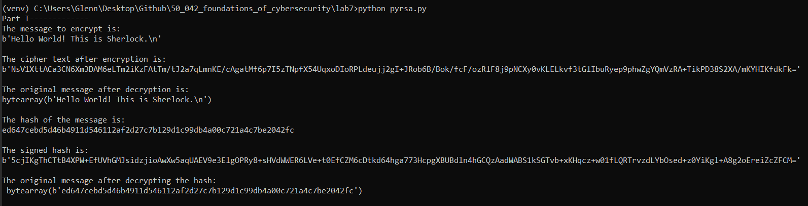

# 1. Installations

1. Helper call to change directory

   ```
   cd C:\Users\Glenn\Desktop\Github\50_042_foundations_of_cybersecurity\lab7
   ```

2. Create a virtual environment

   ```
   python -m venv venv
   ```

3. Activate the virtual environment 

   ```
   venv\Scripts\activate
   ```

4. Install `pycryptodome` since the documentation shows that it supports newer python versions  https://pypi.org/project/pycryptodome/ 

   ```
   pip install pycryptodome
   ```

# 2. Part I

## 2.1 Reading the message

- Note that the original message has a return. If we want to ignore it we can do `readline()` because the file has a return 
- We have to `encode` which has a default encoding of `UTF-8`. If we don't do this, we will get an error `TypeError: string argument without an encoding`

```python
 with open("message.txt") as f_message:
        message = f_message.read().encode()
```

## 2.2 Printing the ciphertext

To print the ciphertext, we need to encode it as without encoding, it will just be numbers printed out on the screen

We encode using `base64.b64encode(s[, altchars])`

The link to the documentation is here  https://www.base64encode.net/python-base64-b64encode 

## 2.3 Results



# 3. Part 2

## 3.1 Using SHA256

Link:  https://pycryptodome.readthedocs.io/en/latest/src/hash/sha256.html 

```python
message_hash = SHA256.new()
message_hash.update(message)
message_hash_digest = message_hash.hexdigest()
```

However, when we pass it into the encryption function, we get the following error: `TypeError: string argument without an encoding` which comes from `b=bytearray(b)`. This is because the string does not have a recognised encoding. Hence, we need to specify that it is encoded by `utf-8`

```python
encrypted_hash = encrypt_RSA('mykey.pem.pub', message_hash_digest.encode(encoding='utf-8'))
```

## 3.2 Results

